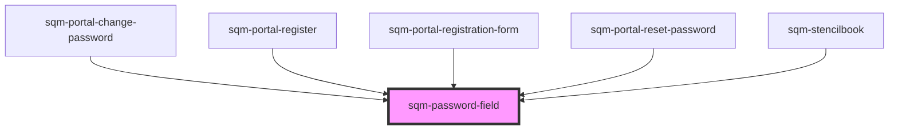

# sqm-password-field

<!-- Auto Generated Below -->

## Properties

| Property           | Attribute           | Description                     | Type                         | Default      |
| ------------------ | ------------------- | ------------------------------- | ---------------------------- | ------------ |
| `demoData`         | --                  |                                 | `PasswordFieldViewDemoProps` | `undefined`  |
| `enableValidation` | `enable-validation` | Enable live password validation | `boolean`                    | `true`       |
| `fieldLabel`       | `field-label`       | Label for password field        | `string`                     | `"Password"` |

## Dependencies

### Used by

 - [sqm-portal-change-password](../sqm-portal-change-password)
 - [sqm-portal-register](../sqm-portal-register)
 - [sqm-portal-registration-form](../sqm-portal-registration-form)
 - [sqm-portal-reset-password](../sqm-portal-reset-password)
 - [sqm-stencilbook](../sqm-stencilbook)

### Graph

----------------------------------------------

*Built with [StencilJS](https://stenciljs.com/)*
