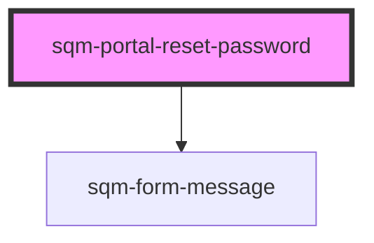

# sqm-portal-reset-password

<!-- Auto Generated Below -->

## Properties

| Property          | Attribute          | Description | Type                                                                                                                                              | Default     |
| ----------------- | ------------------ | ----------- | ------------------------------------------------------------------------------------------------------------------------------------------------- | ----------- |
| `confirmPassword` | `confirm-password` |             | `boolean`                                                                                                                                         | `false`     |
| `demoData`        | --                 |             | `{ states?: { error: string; loading: boolean; reset: boolean; confirmPassword: boolean; oobCodeValidating: boolean; oobCodeValid: boolean; }; }` | `undefined` |
| `nextPage`        | `next-page`        |             | `string`                                                                                                                                          | `"/"`       |

## Dependencies

### Depends on

- [sqm-form-message](../sqm-form-message)

### Graph

----------------------------------------------

*Built with [StencilJS](https://stenciljs.com/)*
