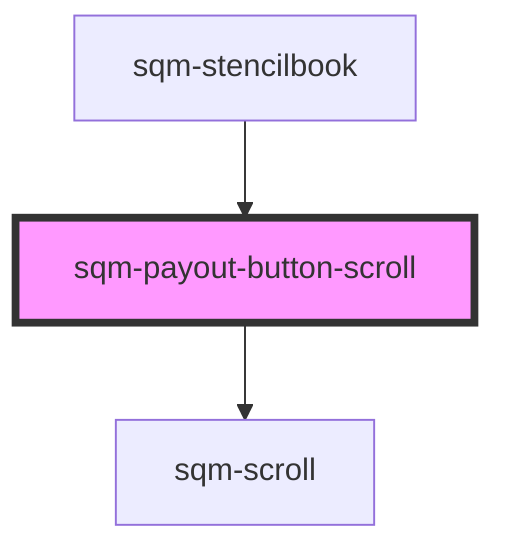

# sqm-payout-button-scroll

<!-- Auto Generated Below -->

## Properties

| Property                  | Attribute                   | Description                          | Type                                                 | Default                                                             |
| ------------------------- | --------------------------- | ------------------------------------ | ---------------------------------------------------- | ------------------------------------------------------------------- |
| `demoData`                | --                          |                                      | `{ states?: { payoutSettingsComplete: boolean; }; }` | `undefined`                                                         |
| `payoutButtonDescription` | `payout-button-description` | Description text under payout button | `string`                                             | `"Check your payout settings to see when you’ll get paid out next"` |
| `payoutButtonText`        | `payout-button-text`        |                                      | `string`                                             | `"Payouts & Tax Settings"`                                          |

## Dependencies

### Used by

 - [sqm-stencilbook](../sqm-stencilbook)

### Depends on

- [sqm-scroll](../sqm-scroll)

### Graph

----------------------------------------------

*Built with [StencilJS](https://stenciljs.com/)*
