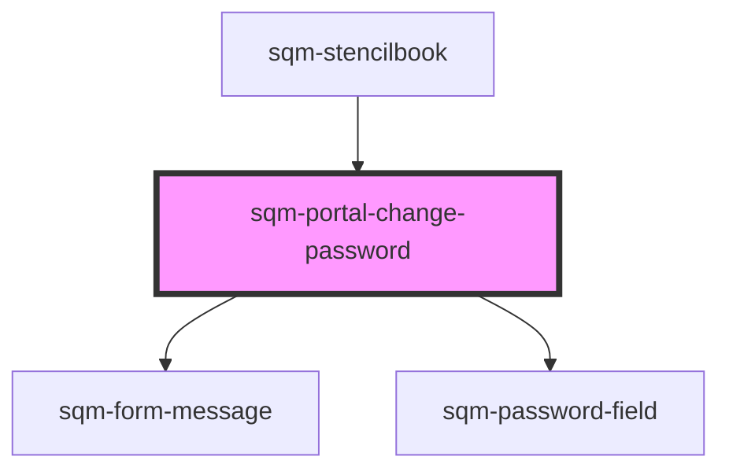

# sqm-portal-change-password

<!-- Auto Generated Below -->

## Properties

| Property                         | Attribute                            | Description                           | Type                                                                                                                                                                                                                                                                                                                                                                                                                                                                                                                                                                                                                                           | Default                                            |
| -------------------------------- | ------------------------------------ | ------------------------------------- | ---------------------------------------------------------------------------------------------------------------------------------------------------------------------------------------------------------------------------------------------------------------------------------------------------------------------------------------------------------------------------------------------------------------------------------------------------------------------------------------------------------------------------------------------------------------------------------------------------------------------------------------------- | -------------------------------------------------- |
| `cancelText`                     | `cancel-text`                        | Found in modal                        | `string`                                                                                                                                                                                                                                                                                                                                                                                                                                                                                                                                                                                                                                       | `"Cancel"`                                         |
| `changePasswordButtonText`       | `change-password-button-text`        | Found in modal                        | `string`                                                                                                                                                                                                                                                                                                                                                                                                                                                                                                                                                                                                                                       | `"Change Password"`                                |
| `confirmPasswordFieldLabel`      | `confirm-password-field-label`       | Found in modal                        | `string`                                                                                                                                                                                                                                                                                                                                                                                                                                                                                                                                                                                                                                       | `"Confirm New Password"`                           |
| `demoData`                       | --                                   |                                       | `{ states?: { open: boolean; error: string; loading: boolean; success: boolean; content: { modalChangePasswordHeader: string; cancelText: string; changePasswordButtonText: string; passwordFieldLabel: string; confirmPasswordFieldLabel: string; successMessage: string; portalChangePasswordHeader: string; portalChangePasswordButtonText: string; meetsRequirementsText?: string; doesNotMeetRequirementsText?: string; minErrorText?: string; uppercaseErrorText?: string; lowercaseErrorText?: string; hasErrorText?: string; }; }; borderRadius?: string; buttonType?: "primary" \| "secondary" \| "tertiary"; background?: string; }` | `undefined`                                        |
| `doesNotMeetRequirementsText`    | `does-not-meet-requirements-text`    |                                       | `string`                                                                                                                                                                                                                                                                                                                                                                                                                                                                                                                                                                                                                                       | `"Password must meet the following requirements:"` |
| `hasErrorText`                   | `has-error-text`                     |                                       | `string`                                                                                                                                                                                                                                                                                                                                                                                                                                                                                                                                                                                                                                       | `"contain at least 1 number or symbol"`            |
| `invalidSessionErrorText`        | `invalid-session-error-text`         |                                       | `string`                                                                                                                                                                                                                                                                                                                                                                                                                                                                                                                                                                                                                                       | `"Please log in again to change your password."`   |
| `lowercaseErrorText`             | `lowercase-error-text`               |                                       | `string`                                                                                                                                                                                                                                                                                                                                                                                                                                                                                                                                                                                                                                       | `"contain at least 1 lowercase character"`         |
| `meetsRequirementsText`          | `meets-requirements-text`            |                                       | `string`                                                                                                                                                                                                                                                                                                                                                                                                                                                                                                                                                                                                                                       | `"Password has met all requirements"`              |
| `minErrorText`                   | `min-error-text`                     |                                       | `string`                                                                                                                                                                                                                                                                                                                                                                                                                                                                                                                                                                                                                                       | `"be a minimum of 8 characters"`                   |
| `modalChangePasswordHeader`      | `modal-change-password-header`       |                                       | `string`                                                                                                                                                                                                                                                                                                                                                                                                                                                                                                                                                                                                                                       | `"Change Password"`                                |
| `nonMatchingPasswordErrorText`   | `non-matching-password-error-text`   |                                       | `string`                                                                                                                                                                                                                                                                                                                                                                                                                                                                                                                                                                                                                                       | `"contain at least 1 lowercase character"`         |
| `passwordFieldLabel`             | `password-field-label`               | Found in modal                        | `string`                                                                                                                                                                                                                                                                                                                                                                                                                                                                                                                                                                                                                                       | `"New Password"`                                   |
| `portalChangePasswordButtonText` | `portal-change-password-button-text` |                                       | `string`                                                                                                                                                                                                                                                                                                                                                                                                                                                                                                                                                                                                                                       | `"Change your password..."`                        |
| `portalChangePasswordHeader`     | `portal-change-password-header`      | Portal change password section header | `string`                                                                                                                                                                                                                                                                                                                                                                                                                                                                                                                                                                                                                                       | `"Password"`                                       |
| `successMessage`                 | `success-message`                    | Successful password change message    | `string`                                                                                                                                                                                                                                                                                                                                                                                                                                                                                                                                                                                                                                       | `"Your password has been updated."`                |
| `uppercaseErrorText`             | `uppercase-error-text`               |                                       | `string`                                                                                                                                                                                                                                                                                                                                                                                                                                                                                                                                                                                                                                       | `"contain at least 1 uppercase character"`         |

## Dependencies

### Used by

 - [sqm-stencilbook](../sqm-stencilbook)

### Depends on

- [sqm-form-message](../sqm-form-message)
- [sqm-password-field](../sqm-password-field)

### Graph

----------------------------------------------

*Built with [StencilJS](https://stenciljs.com/)*
