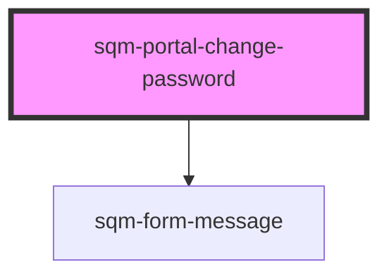

# sqm-sidebar-item

<!-- Auto Generated Below -->

## Properties

| Property   | Attribute | Description | Type                                                                                  | Default     |
| ---------- | --------- | ----------- | ------------------------------------------------------------------------------------- | ----------- |
| `demoData` | --        |             | `{ states?: { open: boolean; error: string; loading: boolean; success: boolean; }; }` | `undefined` |

## Dependencies

### Depends on

- [sqm-form-message](../sqm-form-message)

### Graph

----------------------------------------------

*Built with [StencilJS](https://stenciljs.com/)*
