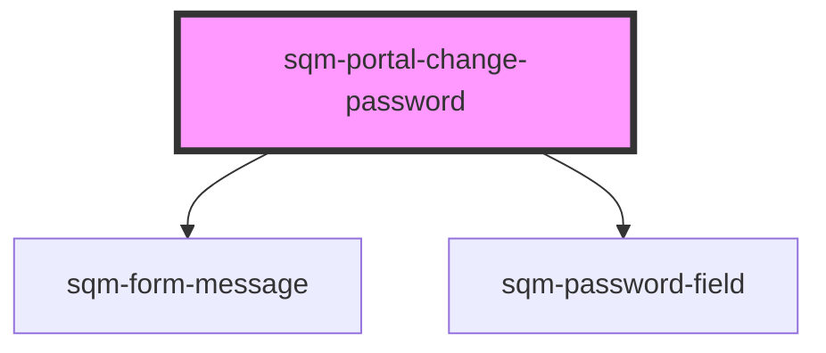

# sqm-portal-change-password

<!-- Auto Generated Below -->

## Properties

| Property                         | Attribute                            | Description | Type                                                                                                                                                                                                                                                                                                                                                            | Default                             |
| -------------------------------- | ------------------------------------ | ----------- | --------------------------------------------------------------------------------------------------------------------------------------------------------------------------------------------------------------------------------------------------------------------------------------------------------------------------------------------------------------- | ----------------------------------- |
| `cancelText`                     | `cancel-text`                        |             | `string`                                                                                                                                                                                                                                                                                                                                                        | `"Cancel"`                          |
| `changePasswordButtonText`       | `change-password-button-text`        |             | `string`                                                                                                                                                                                                                                                                                                                                                        | `"Change Password"`                 |
| `confirmPasswordFieldLabel`      | `confirm-password-field-label`       |             | `string`                                                                                                                                                                                                                                                                                                                                                        | `"Confirm New Password"`            |
| `demoData`                       | --                                   |             | `{ states?: { open: boolean; error: string; loading: boolean; success: boolean; content: { modalChangePasswordHeader: string; cancelText: string; changePasswordButtonText: string; passwordFieldLabel: string; confirmPasswordFieldLabel: string; successMessage: string; portalChangePasswordHeader: string; portalChangePasswordButtonText: string; }; }; }` | `undefined`                         |
| `modalChangePasswordHeader`      | `modal-change-password-header`       |             | `string`                                                                                                                                                                                                                                                                                                                                                        | `"Change Password"`                 |
| `passwordFieldLabel`             | `password-field-label`               |             | `string`                                                                                                                                                                                                                                                                                                                                                        | `"New Password"`                    |
| `portalChangePasswordButtonText` | `portal-change-password-button-text` |             | `string`                                                                                                                                                                                                                                                                                                                                                        | `"Change your password..."`         |
| `portalChangePasswordHeader`     | `portal-change-password-header`      |             | `string`                                                                                                                                                                                                                                                                                                                                                        | `"Password"`                        |
| `successMessage`                 | `success-message`                    |             | `string`                                                                                                                                                                                                                                                                                                                                                        | `"Your password has been updated."` |

## Dependencies

### Depends on

- [sqm-form-message](../sqm-form-message)
- [sqm-password-field](../sqm-password-field)

### Graph

----------------------------------------------

*Built with [StencilJS](https://stenciljs.com/)*
