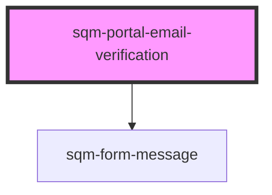

# sqm-portal-email-verification

<!-- Auto Generated Below -->

## Properties

| Property                  | Attribute                   | Description                                                        | Type                                                                                                                                                                                        | Default                                                                                           |
| ------------------------- | --------------------------- | ------------------------------------------------------------------ | ------------------------------------------------------------------------------------------------------------------------------------------------------------------------------------------- | ------------------------------------------------------------------------------------------------- |
| `demoData`                | --                          |                                                                    | `{ states?: { error: string; loading: boolean; success: boolean; }; content?: { email: string; verifyMessage: string; emailVerificationHeader: string; resendEmailButtonText: string; }; }` | `undefined`                                                                                       |
| `emailVerificationHeader` | `email-verification-header` |                                                                    | `string`                                                                                                                                                                                    | `"Verify your email"`                                                                             |
| `redirectPath`            | `redirect-path`             | The page that users are redirected to from the verification email. | `string`                                                                                                                                                                                    | `"/verifyEmail"`                                                                                  |
| `resendEmailButtonText`   | `resend-email-button-text`  |                                                                    | `string`                                                                                                                                                                                    | `"Re-send Email"`                                                                                 |
| `verifyMessage`           | `verify-message`            |                                                                    | `string`                                                                                                                                                                                    | `"A verification email was sent to {email}. Please verify your email to continue to the portal."` |

## Dependencies

### Depends on

- [sqm-form-message](../sqm-form-message)

### Graph

----------------------------------------------

*Built with [StencilJS](https://stenciljs.com/)*
