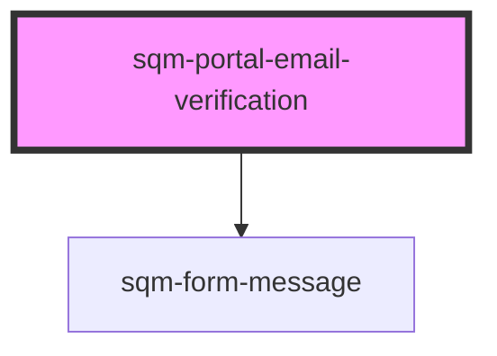

# sqm-portal-email-verification

<!-- Auto Generated Below -->

## Properties

| Property                     | Attribute                      | Description                                                       | Type                                                                                                                                                                                                                                                                                                                                                                              | Default                                                                                                                                                  |
| ---------------------------- | ------------------------------ | ----------------------------------------------------------------- | --------------------------------------------------------------------------------------------------------------------------------------------------------------------------------------------------------------------------------------------------------------------------------------------------------------------------------------------------------------------------------- | -------------------------------------------------------------------------------------------------------------------------------------------------------- |
| `demoData`                   | --                             |                                                                   | `{ states?: { error: string; loading: boolean; success: boolean; isVerified?: boolean; loadingVerification?: boolean; countdown?: number; }; content?: { email: string; verifyMessage: string; emailVerificationHeader: string; resendEmailButtonText: string; verificationStatusMessage?: string; verificationLoadingMessage?: string; verificationResentMessage?: string; }; }` | `undefined`                                                                                                                                              |
| `emailVerificationHeader`    | `email-verification-header`    |                                                                   | `string`                                                                                                                                                                                                                                                                                                                                                                          | `"Verify your email"`                                                                                                                                    |
| `networkErrorMessage`        | `network-error-message`        |                                                                   | `string`                                                                                                                                                                                                                                                                                                                                                                          | `"An error occurred while verifying your password. Please refresh the page."`                                                                            |
| `redirectPath`               | `redirect-path`                | Redirect participants to this page from their verification email. | `string`                                                                                                                                                                                                                                                                                                                                                                          | `"/verifyEmail"`                                                                                                                                         |
| `resendEmailButtonText`      | `resend-email-button-text`     |                                                                   | `string`                                                                                                                                                                                                                                                                                                                                                                          | `"Re-send Email"`                                                                                                                                        |
| `verificationLoadingMessage` | `verification-loading-message` |                                                                   | `string`                                                                                                                                                                                                                                                                                                                                                                          | `"Checking verification status"`                                                                                                                         |
| `verificationResentMessage`  | `verification-resent-message`  |                                                                   | `string`                                                                                                                                                                                                                                                                                                                                                                          | `"Your verification email has been resent successfully"`                                                                                                 |
| `verificationStatusMessage`  | `verification-status-message`  |                                                                   | `string`                                                                                                                                                                                                                                                                                                                                                                          | `"Checking verification status in {countdown}"`                                                                                                          |
| `verifyMessage`              | `verify-message`               |                                                                   | `string`                                                                                                                                                                                                                                                                                                                                                                          | `"A verification email was sent to {email}. Please verify your email to continue to the portal. Resending an email will invalidate the previous email."` |

## Dependencies

### Depends on

- [sqm-form-message](../sqm-form-message)

### Graph

----------------------------------------------

*Built with [StencilJS](https://stenciljs.com/)*
