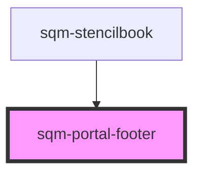

# sqm-portal-footer

<!-- Auto Generated Below -->

## Properties

| Property          | Attribute           | Description | Type      | Default                                  |
| ----------------- | ------------------- | ----------- | --------- | ---------------------------------------- |
| `faqLink`         | `faq-link`          |             | `string`  | `undefined`                              |
| `faqText`         | `faq-text`          |             | `string`  | `undefined`                              |
| `hidePoweredBy`   | `hide-powered-by`   |             | `boolean` | `false`                                  |
| `hideSupportText` | `hide-support-text` |             | `boolean` | `false`                                  |
| `paddingBottom`   | `padding-bottom`    |             | `string`  | `"large"`                                |
| `paddingLeft`     | `padding-left`      |             | `string`  | `"large"`                                |
| `paddingRight`    | `padding-right`     |             | `string`  | `"large"`                                |
| `paddingTop`      | `padding-top`       |             | `string`  | `"large"`                                |
| `poweredByLink`   | `powered-by-link`   |             | `string`  | `"https://impact.com/advocate/"`         |
| `supportEmail`    | `support-email`     |             | `string`  | `"support@example.com"`                  |
| `supportText`     | `support-text`      |             | `string`  | `"For program support, contact {email}"` |
| `termsLink`       | `terms-link`        |             | `string`  | `undefined`                              |
| `termsText`       | `terms-text`        |             | `string`  | `undefined`                              |

## Dependencies

### Used by

 - [sqm-stencilbook](../sqm-stencilbook)

### Graph

----------------------------------------------

*Built with [StencilJS](https://stenciljs.com/)*
