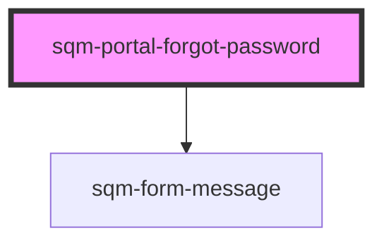

# sqm-portal-forgot-password

<!-- Auto Generated Below -->

## Properties

| Property       | Attribute       | Description                                                          | Type                                                                                                                                                                                        | Default                    |
| -------------- | --------------- | -------------------------------------------------------------------- | ------------------------------------------------------------------------------------------------------------------------------------------------------------------------------------------- | -------------------------- |
| `demoData`     | --              |                                                                      | `{ states?: { error: string; loading: boolean; success: boolean; loginPath: string; }; content?: { secondaryButton: any; messageSlot: any; emailLabel?: string; submitLabel?: string; }; }` | `undefined`                |
| `emailLabel`   | `email-label`   |                                                                      | `string`                                                                                                                                                                                    | `"Email"`                  |
| `loginPath`    | `login-path`    |                                                                      | `string`                                                                                                                                                                                    | `"/login"`                 |
| `redirectPath` | `redirect-path` | The page that users are redirected to from the password reset email. | `string`                                                                                                                                                                                    | `"/resetPassword"`         |
| `submitLabel`  | `submit-label`  |                                                                      | `string`                                                                                                                                                                                    | `"Request Password Reset"` |

## Dependencies

### Depends on

- [sqm-form-message](../sqm-form-message)

### Graph

----------------------------------------------

*Built with [StencilJS](https://stenciljs.com/)*
