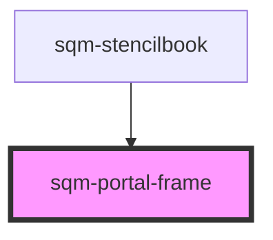

# sqm-portal-frame

<!-- Auto Generated Below -->

## Properties

| Property   | Attribute | Description | Type                                            | Default     |
| ---------- | --------- | ----------- | ----------------------------------------------- | ----------- |
| `demoData` | --        |             | `{ data?: { footer: VNode; header: VNode; }; }` | `undefined` |

## Dependencies

### Used by

 - [sqm-stencilbook](../sqm-stencilbook)

### Graph

----------------------------------------------

*Built with [StencilJS](https://stenciljs.com/)*
