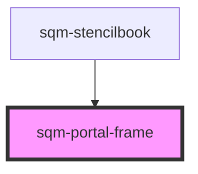

# sqm-portal-frame

<!-- Auto Generated Below -->

## Properties

| Property                         | Attribute                            | Description                                                             | Type                                                                                                                                                         | Default                                                                     |
| -------------------------------- | ------------------------------------ | ----------------------------------------------------------------------- | ------------------------------------------------------------------------------------------------------------------------------------------------------------ | --------------------------------------------------------------------------- |
| `backgroundColor`                | `background-color`                   |                                                                         | `string`                                                                                                                                                     | `"var(--sqm-portal-background, #fff)"`                                      |
| `border`                         | `border`                             | Borders placed to seperate the header and footer from the body content. | `string`                                                                                                                                                     | `"var(--sqm-border-thickness, 1px) solid var(--sqm-border-color, #eaeaea)"` |
| `demoData`                       | --                                   |                                                                         | `{ data?: { footer: VNode; header: VNode; }; backgroundColor?: string; notFullScreen?: boolean; border?: string; headerAndFooterBackgroundColor?: string; }` | `undefined`                                                                 |
| `headerAndFooterBackgroundColor` | `header-and-footer-background-color` | Background color for the header and footer.                             | `string`                                                                                                                                                     | `"var(--sqm-portal-background, #fff)"`                                      |
| `notFullScreen`                  | `not-full-screen`                    |                                                                         | `boolean`                                                                                                                                                    | `false`                                                                     |

## Dependencies

### Used by

 - [sqm-stencilbook](../sqm-stencilbook)

### Graph

----------------------------------------------

*Built with [StencilJS](https://stenciljs.com/)*
