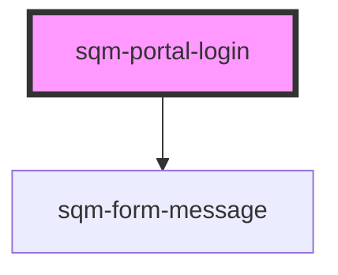

# stn-login

<!-- Auto Generated Below -->

## Properties

| Property               | Attribute                 | Description | Type     | Default                     |
| ---------------------- | ------------------------- | ----------- | -------- | --------------------------- |
| `emailLabel`           | `email-label`             |             | `string` | `"Email"`                   |
| `nextPage`             | `next-page`               |             | `string` | `"/"`                       |
| `nextPageUrlParameter` | `next-page-url-parameter` |             | `string` | `"nextPage"`                |
| `pageLabel`            | `page-label`              |             | `string` | `"Sign in to your account"` |
| `passwordLabel`        | `password-label`          |             | `string` | `"Password"`                |
| `submitLabel`          | `submit-label`            |             | `string` | `"Sign In"`                 |

## Dependencies

### Depends on

- [sqm-form-message](../sqm-form-message)

### Graph

----------------------------------------------

*Built with [StencilJS](https://stenciljs.com/)*
