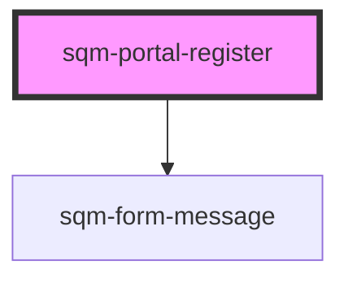

# sqm-portal-register

<!-- Auto Generated Below -->

## Properties

| Property          | Attribute          | Description | Type      | Default      |
| ----------------- | ------------------ | ----------- | --------- | ------------ |
| `confirmPassword` | `confirm-password` |             | `boolean` | `false`      |
| `emailLabel`      | `email-label`      |             | `string`  | `"Email"`    |
| `hideInputs`      | `hide-inputs`      |             | `boolean` | `false`      |
| `nextPage`        | `next-page`        |             | `string`  | `"/"`        |
| `pageLabel`       | `page-label`       |             | `string`  | `"Register"` |
| `passwordLabel`   | `password-label`   |             | `string`  | `"Password"` |
| `submitLabel`     | `submit-label`     |             | `string`  | `"Register"` |

## Dependencies

### Depends on

- [sqm-form-message](../sqm-form-message)

### Graph

----------------------------------------------

*Built with [StencilJS](https://stenciljs.com/)*
