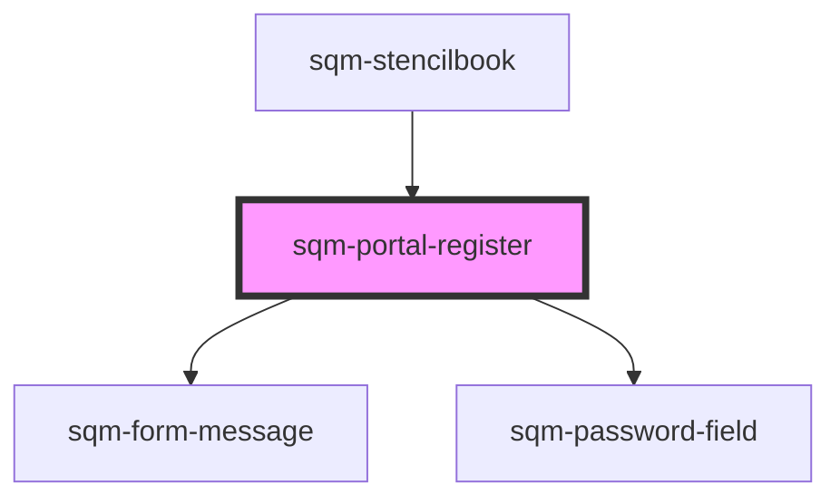

# sqm-portal-register

<!-- Auto Generated Below -->

## Properties

| Property                   | Attribute                    | Description | Type                                                                                                                                                                                                                                                                                                                                                                                           | Default              |
| -------------------------- | ---------------------------- | ----------- | ---------------------------------------------------------------------------------------------------------------------------------------------------------------------------------------------------------------------------------------------------------------------------------------------------------------------------------------------------------------------------------------------- | -------------------- |
| `confirmPassword`          | `confirm-password`           |             | `boolean`                                                                                                                                                                                                                                                                                                                                                                                      | `false`              |
| `confirmPasswordLabel`     | `confirm-password-label`     |             | `string`                                                                                                                                                                                                                                                                                                                                                                                       | `"Confirm Password"` |
| `demoData`                 | --                           |             | `{ states?: { error: string; loading: boolean; confirmPassword: boolean; hideInputs: boolean; validationState?: FormState; enablePasswordValidation?: boolean; }; content?: { formData?: any; passwordField?: any; secondaryButton?: any; emailLabel?: string; passwordLabel?: string; submitLabel?: string; pageLabel?: string; confirmPasswordLabel: string; }; refs?: { formRef: any; }; }` | `undefined`          |
| `emailLabel`               | `email-label`                |             | `string`                                                                                                                                                                                                                                                                                                                                                                                       | `"Email"`            |
| `enablePasswordValidation` | `enable-password-validation` |             | `boolean`                                                                                                                                                                                                                                                                                                                                                                                      | `true`               |
| `hideInputs`               | `hide-inputs`                |             | `boolean`                                                                                                                                                                                                                                                                                                                                                                                      | `false`              |
| `loginLabel`               | `login-label`                |             | `string`                                                                                                                                                                                                                                                                                                                                                                                       | `"Sign in"`          |
| `nextPage`                 | `next-page`                  |             | `string`                                                                                                                                                                                                                                                                                                                                                                                       | `"/"`                |
| `pageLabel`                | `page-label`                 |             | `string`                                                                                                                                                                                                                                                                                                                                                                                       | `"Register"`         |
| `passwordLabel`            | `password-label`             |             | `string`                                                                                                                                                                                                                                                                                                                                                                                       | `"Password"`         |
| `submitLabel`              | `submit-label`               |             | `string`                                                                                                                                                                                                                                                                                                                                                                                       | `"Register"`         |

## Dependencies

### Used by

 - [sqm-stencilbook](../sqm-stencilbook)

### Depends on

- [sqm-form-message](../sqm-form-message)
- [sqm-password-field](../sqm-password-field)

### Graph

----------------------------------------------

*Built with [StencilJS](https://stenciljs.com/)*
