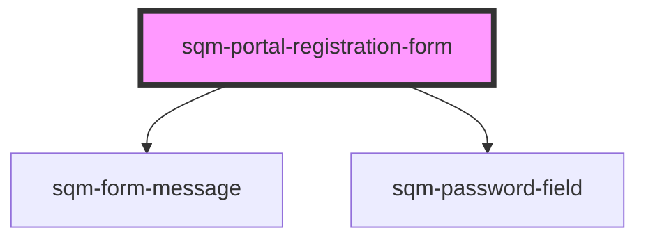

# sqm-portal-registration-form

<!-- Auto Generated Below -->

## Properties

| Property                   | Attribute                    | Description                                                        | Type                                                                                                                                                                                                                                                                                                                                                                                                                                   | Default              |
| -------------------------- | ---------------------------- | ------------------------------------------------------------------ | -------------------------------------------------------------------------------------------------------------------------------------------------------------------------------------------------------------------------------------------------------------------------------------------------------------------------------------------------------------------------------------------------------------------------------------- | -------------------- |
| `confirmPassword`          | `confirm-password`           | Show or hide the confirm password input                            | `boolean`                                                                                                                                                                                                                                                                                                                                                                                                                              | `false`              |
| `confirmPasswordLabel`     | `confirm-password-label`     |                                                                    | `string`                                                                                                                                                                                                                                                                                                                                                                                                                               | `"Confirm Password"` |
| `demoData`                 | --                           |                                                                    | `{ states?: { error: string; loading: boolean; confirmPassword: boolean; hideInputs: boolean; validationState?: FormState; enablePasswordValidation?: boolean; loginPath: string; }; refs?: { formRef: any; }; content?: { formData?: VNode; terms?: VNode; passwordField?: VNode; secondaryButton?: VNode; emailLabel?: string; passwordLabel?: string; submitLabel?: string; pageLabel?: string; confirmPasswordLabel: string; }; }` | `undefined`          |
| `emailLabel`               | `email-label`                |                                                                    | `string`                                                                                                                                                                                                                                                                                                                                                                                                                               | `"Email"`            |
| `enablePasswordValidation` | `enable-password-validation` |                                                                    | `boolean`                                                                                                                                                                                                                                                                                                                                                                                                                              | `true`               |
| `hideInputs`               | `hide-inputs`                | Hide default input fields to use custom fields                     | `boolean`                                                                                                                                                                                                                                                                                                                                                                                                                              | `false`              |
| `loginLabel`               | `login-label`                |                                                                    | `string`                                                                                                                                                                                                                                                                                                                                                                                                                               | `"Sign in"`          |
| `loginPath`                | `login-path`                 | Login button redirection path                                      | `string`                                                                                                                                                                                                                                                                                                                                                                                                                               | `"/login"`           |
| `nextPage`                 | `next-page`                  | Page navigated to after registration                               | `string`                                                                                                                                                                                                                                                                                                                                                                                                                               | `"/"`                |
| `pageLabel`                | `page-label`                 |                                                                    | `string`                                                                                                                                                                                                                                                                                                                                                                                                                               | `"Register"`         |
| `passwordLabel`            | `password-label`             |                                                                    | `string`                                                                                                                                                                                                                                                                                                                                                                                                                               | `"Password"`         |
| `redirectPath`             | `redirect-path`              | The page that users are redirected to from the verification email. | `string`                                                                                                                                                                                                                                                                                                                                                                                                                               | `"/verifyEmail"`     |
| `submitLabel`              | `submit-label`               |                                                                    | `string`                                                                                                                                                                                                                                                                                                                                                                                                                               | `"Register"`         |

## Dependencies

### Depends on

- [sqm-form-message](../sqm-form-message)
- [sqm-password-field](../sqm-password-field)

### Graph

----------------------------------------------

*Built with [StencilJS](https://stenciljs.com/)*
