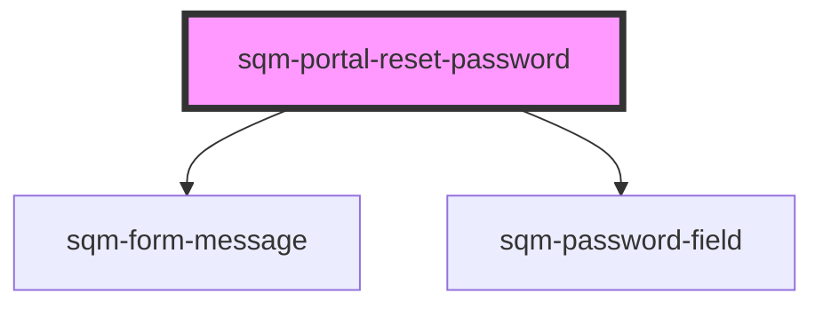

# sqm-portal-reset-password

<!-- Auto Generated Below -->

## Properties

| Property                      | Attribute                         | Description                                                                                  | Type                                                                                                                                                                                                                                                                                                                                                                                                                                                                                                                                                                                                                                                                   | Default                                                                                                          |
| ----------------------------- | --------------------------------- | -------------------------------------------------------------------------------------------- | ---------------------------------------------------------------------------------------------------------------------------------------------------------------------------------------------------------------------------------------------------------------------------------------------------------------------------------------------------------------------------------------------------------------------------------------------------------------------------------------------------------------------------------------------------------------------------------------------------------------------------------------------------------------------- | ---------------------------------------------------------------------------------------------------------------- |
| `codeInvalidText`             | `code-invalid-text`               |                                                                                              | `string`                                                                                                                                                                                                                                                                                                                                                                                                                                                                                                                                                                                                                                                               | `"The password reset code is invalid or has expired, please try again."`                                         |
| `confirmPassword`             | `confirm-password`                |                                                                                              | `boolean`                                                                                                                                                                                                                                                                                                                                                                                                                                                                                                                                                                                                                                                              | `false`                                                                                                          |
| `confirmPasswordFieldLabel`   | `confirm-password-field-label`    |                                                                                              | `string`                                                                                                                                                                                                                                                                                                                                                                                                                                                                                                                                                                                                                                                               | `"Confirm Password"`                                                                                             |
| `continueButtonText`          | `continue-button-text`            | Button text displayed after a successful password reset.                                     | `string`                                                                                                                                                                                                                                                                                                                                                                                                                                                                                                                                                                                                                                                               | `"Continue"`                                                                                                     |
| `demoData`                    | --                                |                                                                                              | `{ states?: { error: string; loading: boolean; reset: boolean; confirmPassword: boolean; oobCodeValidating: boolean; oobCodeValid: boolean; passwordDemoData?: PasswordFieldViewDemoProps; content: { passwordResetHeader: string; resetPasswordHeader: string; continueButtonText: string; resetPasswordButtonText: string; confirmPasswordFieldLabel: string; passwordFieldLabel: string; meetsRequirementsText?: string; doesNotMeetRequirementsText?: string; minErrorText?: string; uppercaseErrorText?: string; lowercaseErrorText?: string; hasErrorText?: string; resetSuccessText?: string; passwordMismatchText?: string; codeInvalidText?: string; }; }; }` | `undefined`                                                                                                      |
| `doesNotMeetRequirementsText` | `does-not-meet-requirements-text` |                                                                                              | `string`                                                                                                                                                                                                                                                                                                                                                                                                                                                                                                                                                                                                                                                               | `"Password must meet the following requirements:"`                                                               |
| `failedPage`                  | `failed-page`                     | Redirect participants to this page if password reset fails due to an outdated reset attempt. | `string`                                                                                                                                                                                                                                                                                                                                                                                                                                                                                                                                                                                                                                                               | `"/"`                                                                                                            |
| `hasErrorText`                | `has-error-text`                  |                                                                                              | `string`                                                                                                                                                                                                                                                                                                                                                                                                                                                                                                                                                                                                                                                               | `"contain at least 1 number or symbol"`                                                                          |
| `lowercaseErrorText`          | `lowercase-error-text`            |                                                                                              | `string`                                                                                                                                                                                                                                                                                                                                                                                                                                                                                                                                                                                                                                                               | `"contain at least 1 lowercase character"`                                                                       |
| `meetsRequirementsText`       | `meets-requirements-text`         |                                                                                              | `string`                                                                                                                                                                                                                                                                                                                                                                                                                                                                                                                                                                                                                                                               | `"Password has met all requirements"`                                                                            |
| `minErrorText`                | `min-error-text`                  |                                                                                              | `string`                                                                                                                                                                                                                                                                                                                                                                                                                                                                                                                                                                                                                                                               | `"be a minimum of 8 characters"`                                                                                 |
| `networkErrorMessage`         | `network-error-message`           |                                                                                              | `string`                                                                                                                                                                                                                                                                                                                                                                                                                                                                                                                                                                                                                                                               | `"Network request failed."`                                                                                      |
| `nextPage`                    | `next-page`                       | Redirect participants to this page when they successfully reset their password.              | `string`                                                                                                                                                                                                                                                                                                                                                                                                                                                                                                                                                                                                                                                               | `"/"`                                                                                                            |
| `passwordFieldLabel`          | `password-field-label`            |                                                                                              | `string`                                                                                                                                                                                                                                                                                                                                                                                                                                                                                                                                                                                                                                                               | `"New Password"`                                                                                                 |
| `passwordMismatchText`        | `password-mismatch-text`          |                                                                                              | `string`                                                                                                                                                                                                                                                                                                                                                                                                                                                                                                                                                                                                                                                               | `"Passwords do not match."`                                                                                      |
| `passwordResetHeader`         | `password-reset-header`           | Displayed after a successful password reset.                                                 | `string`                                                                                                                                                                                                                                                                                                                                                                                                                                                                                                                                                                                                                                                               | `"Password reset"`                                                                                               |
| `resetPasswordButtonText`     | `reset-password-button-text`      |                                                                                              | `string`                                                                                                                                                                                                                                                                                                                                                                                                                                                                                                                                                                                                                                                               | `"Reset Password"`                                                                                               |
| `resetPasswordHeader`         | `reset-password-header`           |                                                                                              | `string`                                                                                                                                                                                                                                                                                                                                                                                                                                                                                                                                                                                                                                                               | `"Reset your password"`                                                                                          |
| `resetSuccessText`            | `reset-success-text`              |                                                                                              | `string`                                                                                                                                                                                                                                                                                                                                                                                                                                                                                                                                                                                                                                                               | `"Your password has been reset and you are being redirected. If you are not redirected, please click Continue."` |
| `uppercaseErrorText`          | `uppercase-error-text`            |                                                                                              | `string`                                                                                                                                                                                                                                                                                                                                                                                                                                                                                                                                                                                                                                                               | `"contain at least 1 uppercase character"`                                                                       |

## Dependencies

### Depends on

- [sqm-form-message](../sqm-form-message)
- [sqm-password-field](../sqm-password-field)

### Graph

----------------------------------------------

*Built with [StencilJS](https://stenciljs.com/)*
