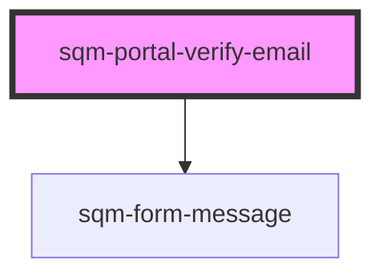

# sqm-portal-verify-email

<!-- Auto Generated Below -->

## Properties

| Property              | Attribute               | Description                                                                                       | Type                                                                                                                                                                                                                         | Default                                                                                                          |
| --------------------- | ----------------------- | ------------------------------------------------------------------------------------------------- | ---------------------------------------------------------------------------------------------------------------------------------------------------------------------------------------------------------------------------- | ---------------------------------------------------------------------------------------------------------------- |
| `continueText`        | `continue-text`         |                                                                                                   | `string`                                                                                                                                                                                                                     | `"Continue"`                                                                                                     |
| `demoData`            | --                      |                                                                                                   | `{ states?: { error: string; loading: boolean; verified: boolean; }; data?: { oobCode: string; }; content?: { verifySuccessText?: string; verifyEmailText?: string; verifyInvalidText?: string; continueText?: string; }; }` | `undefined`                                                                                                      |
| `failedPage`          | `failed-page`           | Redirect participants to this page if verification fails due to an outdated verification attempt. | `string`                                                                                                                                                                                                                     | `"/"`                                                                                                            |
| `networkErrorMessage` | `network-error-message` |                                                                                                   | `string`                                                                                                                                                                                                                     | `"An error occurred while verifying your email. Please refresh the page and try again."`                         |
| `nextPage`            | `next-page`             | Redirect participants to this page when they successfully verify their email.                     | `string`                                                                                                                                                                                                                     | `"/"`                                                                                                            |
| `verifyEmailText`     | `verify-email-text`     |                                                                                                   | `string`                                                                                                                                                                                                                     | `"Verify your email"`                                                                                            |
| `verifyInvalidText`   | `verify-invalid-text`   |                                                                                                   | `string`                                                                                                                                                                                                                     | `"The email verification code is invalid or has expired, please try again."`                                     |
| `verifySuccessText`   | `verify-success-text`   |                                                                                                   | `string`                                                                                                                                                                                                                     | `"Your email has been verified and you are being redirected. If you are not redirected, please click Continue."` |

## Dependencies

### Depends on

- [sqm-form-message](../sqm-form-message)

### Graph

----------------------------------------------

*Built with [StencilJS](https://stenciljs.com/)*
