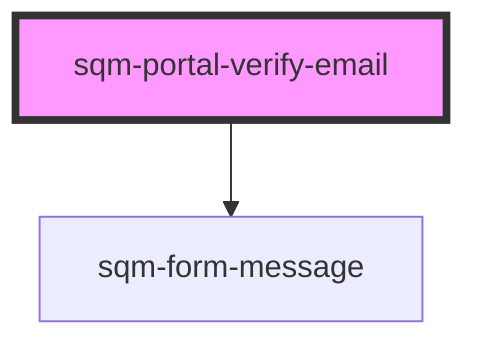

# sqm-portal-verify-email

<!-- Auto Generated Below -->

## Properties

| Property     | Attribute     | Description                                                                                       | Type                                                                                                 | Default     |
| ------------ | ------------- | ------------------------------------------------------------------------------------------------- | ---------------------------------------------------------------------------------------------------- | ----------- |
| `demoData`   | --            |                                                                                                   | `{ states?: { error: string; loading: boolean; verified: boolean; }; data?: { oobCode: string; }; }` | `undefined` |
| `failedPage` | `failed-page` | Redirect participants to this page if verification fails due to an outdated verification attempt. | `string`                                                                                             | `"/"`       |
| `nextPage`   | `next-page`   | Redirect participants to this page when they successfully verify their email.                     | `string`                                                                                             | `"/"`       |

## Dependencies

### Depends on

- [sqm-form-message](../sqm-form-message)

### Graph

----------------------------------------------

*Built with [StencilJS](https://stenciljs.com/)*
