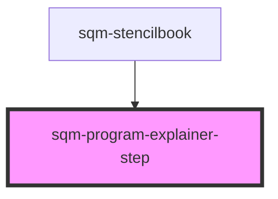

# sqm-program-explainer-step

<!-- Auto Generated Below -->

## Properties

| Property          | Attribute          | Description                                                 | Type     | Default     |
| ----------------- | ------------------ | ----------------------------------------------------------- | -------- | ----------- |
| `backgroundColor` | `background-color` |                                                             | `string` | `undefined` |
| `description`     | `description`      |                                                             | `string` | `undefined` |
| `header`          | `header`           |                                                             | `string` | `undefined` |
| `icon`            | `icon`             | Options available at https://shoelace.style/components/icon | `string` | `undefined` |
| `imageUrl`        | `image-url`        | Displayed in place of an icon                               | `string` | `undefined` |
| `textColor`       | `text-color`       |                                                             | `string` | `undefined` |

## Dependencies

### Used by

 - [sqm-stencilbook](../sqm-stencilbook)

### Graph

----------------------------------------------

*Built with [StencilJS](https://stenciljs.com/)*
