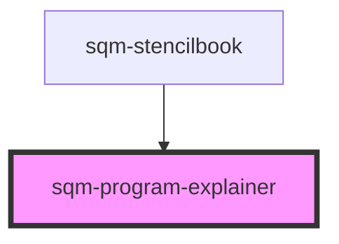

# sqm-program-explainer

<!-- Auto Generated Below -->

## Properties

| Property          | Attribute          | Description | Type     | Default     |
| ----------------- | ------------------ | ----------- | -------- | ----------- |
| `backgroundColor` | `background-color` |             | `string` | `undefined` |
| `header`          | `header`           |             | `string` | `undefined` |
| `textColor`       | `text-color`       |             | `string` | `undefined` |

## Dependencies

### Used by

 - [sqm-stencilbook](../sqm-stencilbook)

### Graph

----------------------------------------------

*Built with [StencilJS](https://stenciljs.com/)*
