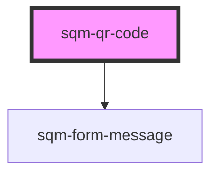

# sqm-qr-code

<!-- Auto Generated Below -->

## Properties

| Property               | Attribute                | Description | Type                                                                                                                                                                                                                                                                                                                      | Default                                     |
| ---------------------- | ------------------------ | ----------- | ------------------------------------------------------------------------------------------------------------------------------------------------------------------------------------------------------------------------------------------------------------------------------------------------------------------------- | ------------------------------------------- |
| `alignment`            | `alignment`              |             | `"center" \| "left" \| "right"`                                                                                                                                                                                                                                                                                           | `"center"`                                  |
| `demoData`             | --                       |             | `{ loading?: boolean; titleText?: string; alignment?: "left" \| "right" \| "center"; error?: boolean; qrLink?: string; createDownloadable?: () => void; hideTitle?: boolean; downloadCodeText?: string; printCodeText?: string; errorHeaderText?: string; errorDescriptionText?: string; createPrintable?: () => void; }` | `undefined`                                 |
| `downloadCodeText`     | `download-code-text`     |             | `string`                                                                                                                                                                                                                                                                                                                  | `"Download"`                                |
| `errorDescriptionText` | `error-description-text` |             | `string`                                                                                                                                                                                                                                                                                                                  | `"Please refresh this page and try again"`  |
| `errorHeaderText`      | `error-header-text`      |             | `string`                                                                                                                                                                                                                                                                                                                  | `"There was an error loading your QR code"` |
| `hideTitle`            | `hide-title`             |             | `boolean`                                                                                                                                                                                                                                                                                                                 | `false`                                     |
| `printCodeText`        | `print-code-text`        |             | `string`                                                                                                                                                                                                                                                                                                                  | `"Print"`                                   |
| `titleText`            | `title-text`             |             | `string`                                                                                                                                                                                                                                                                                                                  | `"Share your QR code"`                      |
| `viewCodeText`         | `view-code-text`         |             | `string`                                                                                                                                                                                                                                                                                                                  | `"View QR code"`                            |

## Dependencies

### Depends on

- [sqm-form-message](../sqm-form-message)

### Graph

----------------------------------------------

*Built with [StencilJS](https://stenciljs.com/)*
