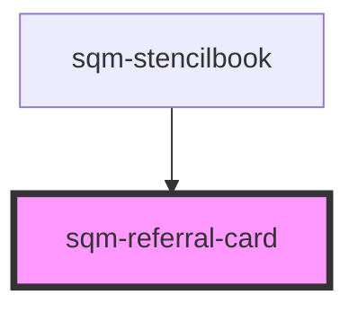

# sqm-referral-card

<!-- Auto Generated Below -->

## Properties

| Property            | Attribute            | Description                                                                    | Type                           | Default     |
| ------------------- | -------------------- | ------------------------------------------------------------------------------ | ------------------------------ | ----------- |
| `backgroundColor`   | `background-color`   |                                                                                | `string`                       | `"#ffffff"` |
| `borderColor`       | `border-color`       | Border color of share link container (default is set to 1px solid transparent) | `string`                       | `undefined` |
| `borderRadius`      | `border-radius`      | The border radius on the share link container (in pixels)                      | `number`                       | `undefined` |
| `hideBorder`        | `hide-border`        |                                                                                | `boolean`                      | `false`     |
| `limitWidth`        | `limit-width`        |                                                                                | `boolean`                      | `false`     |
| `paddingBottom`     | `padding-bottom`     |                                                                                | `string`                       | `"large"`   |
| `paddingLeft`       | `padding-left`       |                                                                                | `string`                       | `"large"`   |
| `paddingRight`      | `padding-right`      |                                                                                | `string`                       | `"large"`   |
| `paddingTop`        | `padding-top`        |                                                                                | `string`                       | `"large"`   |
| `textColor`         | `text-color`         | Color of the text and copy icon                                                | `string`                       | `undefined` |
| `verticalAlignment` | `vertical-alignment` |                                                                                | `"center" \| "end" \| "start"` | `"start"`   |

## Dependencies

### Used by

 - [sqm-stencilbook](../sqm-stencilbook)

### Graph

----------------------------------------------

*Built with [StencilJS](https://stenciljs.com/)*
