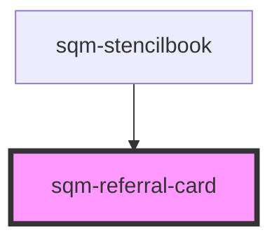

# sqm-referral-card

<!-- Auto Generated Below -->

## Properties

| Property            | Attribute            | Description | Type                           | Default                       |
| ------------------- | -------------------- | ----------- | ------------------------------ | ----------------------------- |
| `backgroundColor`   | `background-color`   |             | `string`                       | `"var(--sl-color-neutral-0)"` |
| `paddingBottom`     | `padding-bottom`     |             | `string`                       | `"large"`                     |
| `paddingLeft`       | `padding-left`       |             | `string`                       | `"large"`                     |
| `paddingRight`      | `padding-right`      |             | `string`                       | `"large"`                     |
| `paddingTop`        | `padding-top`        |             | `string`                       | `"large"`                     |
| `removeBorder`      | `remove-border`      |             | `boolean`                      | `false`                       |
| `verticalAlignment` | `vertical-alignment` |             | `"center" \| "end" \| "start"` | `"start"`                     |

## Dependencies

### Used by

 - [sqm-stencilbook](../sqm-stencilbook)

### Graph

----------------------------------------------

*Built with [StencilJS](https://stenciljs.com/)*
