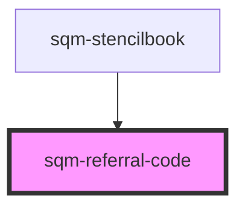

# sqm-share-code

<!-- Auto Generated Below -->

## Properties

| Property               | Attribute                | Description                                                                                                             | Type                                                                                                                                                                                                                                                                                                                                                                                                                                      | Default                            |
| ---------------------- | ------------------------ | ----------------------------------------------------------------------------------------------------------------------- | ----------------------------------------------------------------------------------------------------------------------------------------------------------------------------------------------------------------------------------------------------------------------------------------------------------------------------------------------------------------------------------------------------------------------------------------- | ---------------------------------- |
| `buttonStyle`          | `copy-button-style`      | Set the copy button style and placement                                                                                 | `"button-below" \| "button-outside" \| "icon"`                                                                                                                                                                                                                                                                                                                                                                                            | `"icon"`                           |
| `copyButtonLabel`      | `copy-button-label`      |                                                                                                                         | `string`                                                                                                                                                                                                                                                                                                                                                                                                                                  | `"Copy Code"`                      |
| `demoData`             | --                       |                                                                                                                         | `{ loading?: boolean; copyString?: string; tooltiptext?: string; open?: boolean; copyButtonLabel?: string; disabled?: boolean; textAlign?: "left" \| "right" \| "center"; buttonStyle?: "icon" \| "button-outside" \| "button-below"; error?: boolean; errorText?: string; notificationText?: string; showNotificationText?: boolean; inputPlaceholderText?: string; dateAvailable?: string; isCopied?: boolean; onClick?: () => void; }` | `undefined`                        |
| `notificationText`     | `notification-text`      | Shown underneath the referral code when the user has already copied the code                                            | `string`                                                                                                                                                                                                                                                                                                                                                                                                                                  | `"You've copied this code before"` |
| `programId`            | `program-id`             | The ID of the program that should generate the code. Defaults to the program ID in context where this widget is loaded. | `string`                                                                                                                                                                                                                                                                                                                                                                                                                                  | `undefined`                        |
| `showNotificationText` | `show-notification-text` | Boolean used to show notification text below input                                                                      | `boolean`                                                                                                                                                                                                                                                                                                                                                                                                                                 | `false`                            |
| `textAlign`            | `text-align`             | Change the text alignment                                                                                               | `"center" \| "left" \| "right"`                                                                                                                                                                                                                                                                                                                                                                                                           | `"left"`                           |
| `tooltiplifespan`      | `tooltip-lifespan`       | The number of milliseconds that the tooltip appears for                                                                 | `number`                                                                                                                                                                                                                                                                                                                                                                                                                                  | `1000`                             |
| `tooltiptext`          | `tooltip-text`           | Shown inside a tooltip after someone has successfully copied the link to their clipboard                                | `string`                                                                                                                                                                                                                                                                                                                                                                                                                                  | `"Copied to Clipboard"`            |

## Dependencies

### Used by

 - [sqm-stencilbook](../sqm-stencilbook)

### Graph

----------------------------------------------

*Built with [StencilJS](https://stenciljs.com/)*
