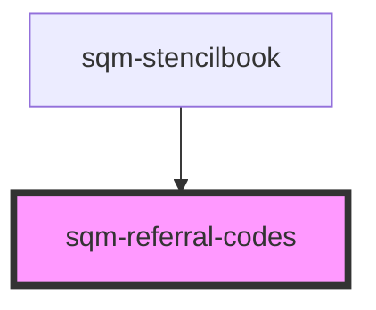

# sqm-referral-codes

<!-- Auto Generated Below -->

## Properties

| Property    | Attribute    | Description | Type                                                                                                                                    | Default                |
| ----------- | ------------ | ----------- | --------------------------------------------------------------------------------------------------------------------------------------- | ---------------------- |
| `demoData`  | --           |             | `{ slots?: { shareButtons: VNode; shareCodes: VNode; pagination: VNode; }; loading?: boolean; titleText?: string; noCodes?: boolean; }` | `undefined`            |
| `titleText` | `title-text` |             | `string`                                                                                                                                | `"Your referral code"` |

## Dependencies

### Used by

 - [sqm-stencilbook](../sqm-stencilbook)

### Graph

----------------------------------------------

*Built with [StencilJS](https://stenciljs.com/)*
