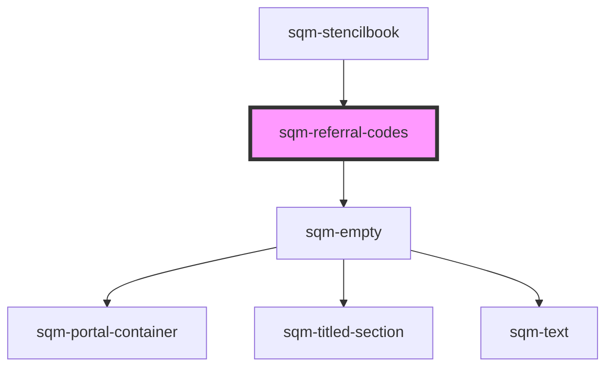

# sqm-referral-codes

<!-- Auto Generated Below -->

## Properties

| Property    | Attribute    | Description | Type                                                                                                                                                                              | Default           |
| ----------- | ------------ | ----------- | --------------------------------------------------------------------------------------------------------------------------------------------------------------------------------- | ----------------- |
| `demoData`  | --           |             | `{ states?: { noCodes: boolean; loading: boolean; }; slots?: { shareButtons: VNode; shareCodes: VNode; pagination: VNode; empty: VNode; loading: VNode; }; titleText?: string; }` | `undefined`       |
| `programId` | `program-id` |             | `string`                                                                                                                                                                          | `undefined`       |
| `titleText` | `title-text` |             | `string`                                                                                                                                                                          | `"Start sharing"` |

## Dependencies

### Used by

 - [sqm-stencilbook](../sqm-stencilbook)

### Depends on

- [sqm-empty](../sqm-empty)

### Graph

----------------------------------------------

*Built with [StencilJS](https://stenciljs.com/)*
