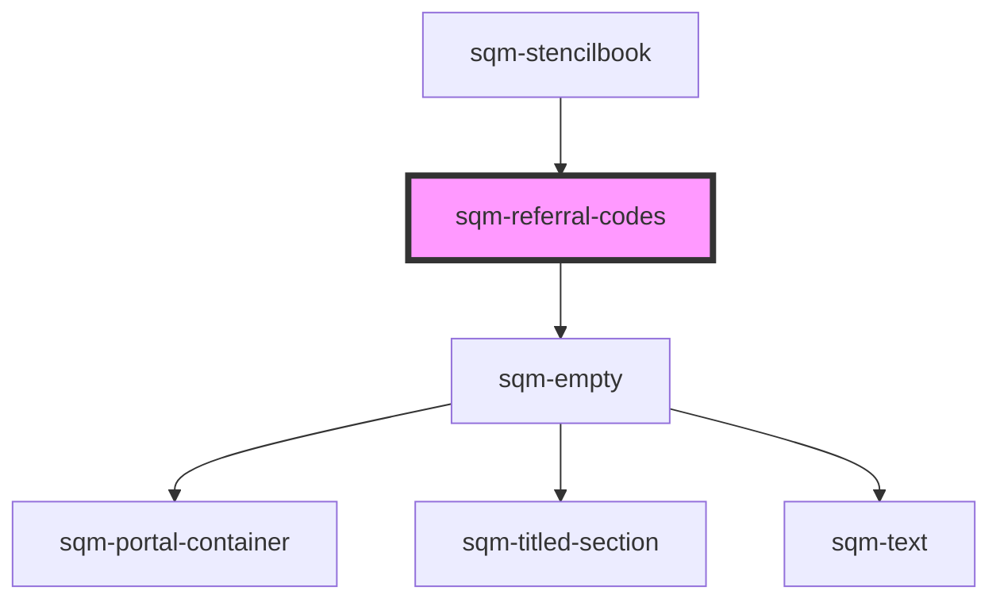

# sqm-referral-codes

<!-- Auto Generated Below -->

## Properties

| Property                    | Attribute                      | Description | Type                                                                                                                                                                                                  | Default                                                                                                  |
| --------------------------- | ------------------------------ | ----------- | ----------------------------------------------------------------------------------------------------------------------------------------------------------------------------------------------------- | -------------------------------------------------------------------------------------------------------- |
| `demoData`                  | --                             |             | `{ states?: { noCodes: boolean; loading: boolean; }; slots?: { shareButtons: VNode; shareCodes: VNode; pagination: VNode; empty: VNode; loading: VNode; }; titleText?: string; textColor?: string; }` | `undefined`                                                                                              |
| `emptyStateDescriptionText` | `empty-state-description-text` |             | `string`                                                                                                                                                                                              | `"Please contact our program support team to let them know you’re out of codes."`                        |
| `emptyStateHeaderText`      | `empty-state-header-text`      |             | `string`                                                                                                                                                                                              | `"Your new codes and links aren’t ready yet"`                                                            |
| `emptyStateImageUrl`        | `empty-state-image-url`        |             | `string`                                                                                                                                                                                              | `"https://res.cloudinary.com/saasquatch/image/upload/v1644360953/squatch-assets/empty_leaderboard2.png"` |
| `programId`                 | `program-id`                   |             | `string`                                                                                                                                                                                              | `undefined`                                                                                              |
| `textColor`                 | `text-color`                   |             | `string`                                                                                                                                                                                              | `undefined`                                                                                              |
| `titleText`                 | `title-text`                   |             | `string`                                                                                                                                                                                              | `"Start sharing"`                                                                                        |

## Dependencies

### Used by

 - [sqm-stencilbook](../sqm-stencilbook)

### Depends on

- [sqm-empty](../sqm-empty)

### Graph

----------------------------------------------

*Built with [StencilJS](https://stenciljs.com/)*
