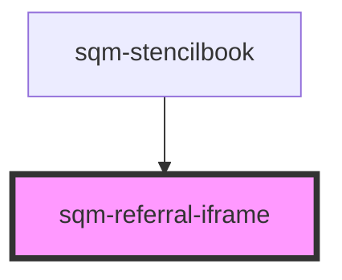

# sqm-referral-iframe

<!-- Auto Generated Below -->

## Properties

| Property       | Attribute       | Description                                                                                                                     | Type                                                                                                                           | Default     |
| -------------- | --------------- | ------------------------------------------------------------------------------------------------------------------------------- | ------------------------------------------------------------------------------------------------------------------------------ | ----------- |
| `demoData`     | --              |                                                                                                                                 | `{ states?: { content: { iframeSrc: string; iframeHeight: string; iframeWidth: string; }; }; data?: { shareCode: string; }; }` | `undefined` |
| `iframeHeight` | `iframe-height` | Define the height of the iframe with any valid CSS height value. Example: 100px, 5rem, or auto.                                 | `string`                                                                                                                       | `"100%"`    |
| `iframeSrc`    | `iframe-src`    | URL of iframe to display                                                                                                        | `string`                                                                                                                       | `undefined` |
| `iframeWidth`  | `iframe-width`  | Width of the iframe container  to Define the width of the iframe with any valid CSS width value. Example: 100px, 5rem, or auto. | `string`                                                                                                                       | `"100%"`    |

## Dependencies

### Used by

 - [sqm-stencilbook](../sqm-stencilbook)

### Graph

----------------------------------------------

*Built with [StencilJS](https://stenciljs.com/)*
