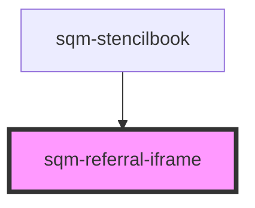

# sqm-referral-iframe

<!-- Auto Generated Below -->

## Properties

| Property       | Attribute       | Description | Type                                                                                                                           | Default     |
| -------------- | --------------- | ----------- | ------------------------------------------------------------------------------------------------------------------------------ | ----------- |
| `demoData`     | --              |             | `{ states?: { content: { iframeSrc: string; iframeHeight: string; iframeWidth: string; }; }; data?: { shareCode: string; }; }` | `undefined` |
| `iframeHeight` | `iframe-height` |             | `string`                                                                                                                       | `"100%"`    |
| `iframeSrc`    | `iframe-src`    |             | `string`                                                                                                                       | `undefined` |
| `iframeWidth`  | `iframe-width`  |             | `string`                                                                                                                       | `"100%"`    |

## Dependencies

### Used by

 - [sqm-stencilbook](../sqm-stencilbook)

### Graph

----------------------------------------------

*Built with [StencilJS](https://stenciljs.com/)*
