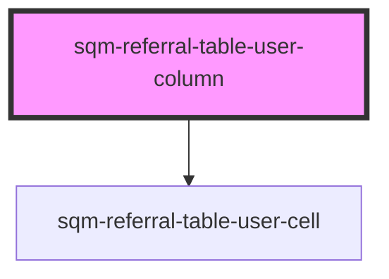

# sqm-referral-table-user-column

<!-- Auto Generated Below -->

## Properties

| Property        | Attribute        | Description | Type     | Default            |
| --------------- | ---------------- | ----------- | -------- | ------------------ |
| `anonymousUser` | `anonymous-user` |             | `string` | `"Anonymous User"` |
| `columnTitle`   | `column-title`   |             | `string` | `"Customer"`       |
| `deletedUser`   | `deleted-user`   |             | `string` | `"Deleted User"`   |

## Methods

### `renderCell(data: Referral) => Promise<any>`

#### Returns

Type: `Promise<any>`

### `renderLabel() => Promise<string>`

#### Returns

Type: `Promise<string>`

### `renderReferrerCell(data: Referrer) => Promise<any>`

#### Returns

Type: `Promise<any>`

## Dependencies

### Depends on

- [sqm-referral-table-user-cell](../cells)

### Graph

----------------------------------------------

*Built with [StencilJS](https://stenciljs.com/)*
