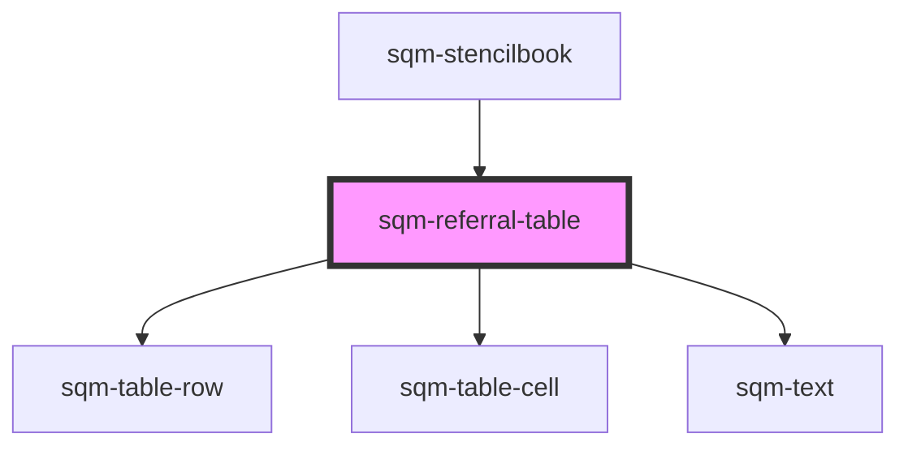

# sqm-referral-table

<!-- Auto Generated Below -->

## Properties

| Property         | Attribute          | Description                                                                                                                                                                                                                                                                   | Type                                                                                                                                                                                                                                                                                                                                                                                                              | Default              |
| ---------------- | ------------------ | ----------------------------------------------------------------------------------------------------------------------------------------------------------------------------------------------------------------------------------------------------------------------------- | ----------------------------------------------------------------------------------------------------------------------------------------------------------------------------------------------------------------------------------------------------------------------------------------------------------------------------------------------------------------------------------------------------------------- | -------------------- |
| `demoData`       | --                 |                                                                                                                                                                                                                                                                               | `{ states?: { hasPrev: boolean; hasNext: boolean; show: "loading" \| "empty" \| "rows"; namespace: string; }; data?: { textOverrides: { showLabels: boolean; prevLabel: string; moreLabel: string; }; hiddenColumns: string; mdBreakpoint: number; smBreakpoint: number; }; elements?: { columns: VNode[]; rows: VNode[][]; loading?: boolean; emptyElement?: VNode; loadingElement?: VNode; page?: number; }; }` | `undefined`          |
| `emptyStateText` | `empty-state-text` |                                                                                                                                                                                                                                                                               | `string`                                                                                                                                                                                                                                                                                                                                                                                                          | `"No Referrals Yet"` |
| `hiddenColumns`  | `hidden-columns`   |                                                                                                                                                                                                                                                                               | `string`                                                                                                                                                                                                                                                                                                                                                                                                          | `"0"`                |
| `mdBreakpoint`   | `md-breakpoint`    |                                                                                                                                                                                                                                                                               | `number`                                                                                                                                                                                                                                                                                                                                                                                                          | `899`                |
| `moreLabel`      | `more-label`       |                                                                                                                                                                                                                                                                               | `string`                                                                                                                                                                                                                                                                                                                                                                                                          | `"Next"`             |
| `perPage`        | `per-page`         |                                                                                                                                                                                                                                                                               | `number`                                                                                                                                                                                                                                                                                                                                                                                                          | `3`                  |
| `prevLabel`      | `prev-label`       |                                                                                                                                                                                                                                                                               | `string`                                                                                                                                                                                                                                                                                                                                                                                                          | `"Prev"`             |
| `programId`      | `program-id`       | Filters to only show referrals in this program. Will default to filtering by the program context where this table lives. If no program ID is set or provided by context, then shows all referrals from all programs. If program ID is "classic", shows classic-only referrals | `string`                                                                                                                                                                                                                                                                                                                                                                                                          | `undefined`          |
| `showLabels`     | `show-labels`      |                                                                                                                                                                                                                                                                               | `boolean`                                                                                                                                                                                                                                                                                                                                                                                                         | `true`               |
| `showReferrer`   | `show-referrer`    |                                                                                                                                                                                                                                                                               | `boolean`                                                                                                                                                                                                                                                                                                                                                                                                         | `false`              |
| `smBreakpoint`   | `sm-breakpoint`    |                                                                                                                                                                                                                                                                               | `number`                                                                                                                                                                                                                                                                                                                                                                                                          | `634`                |

## Dependencies

### Used by

 - [sqm-stencilbook](../sqm-stencilbook)

### Depends on

- [sqm-table-row](../sqm-table-row)
- [sqm-table-cell](../sqm-table-cell)
- [sqm-text](../sqm-text)

### Graph

----------------------------------------------

*Built with [StencilJS](https://stenciljs.com/)*
