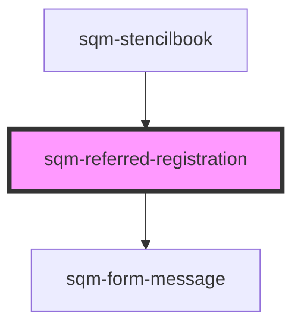

# sqm-portal-login

<!-- Auto Generated Below -->

## Properties

| Property                    | Attribute                      | Description                                                         | Type                                                                                                                                                                                                                                                                                                                                                                                                                                                                                                                                                     | Default                                                                                                                                               |
| --------------------------- | ------------------------------ | ------------------------------------------------------------------- | -------------------------------------------------------------------------------------------------------------------------------------------------------------------------------------------------------------------------------------------------------------------------------------------------------------------------------------------------------------------------------------------------------------------------------------------------------------------------------------------------------------------------------------------------------- | ----------------------------------------------------------------------------------------------------------------------------------------------------- |
| `backgroundColor`           | `background-color`             |                                                                     | `string`                                                                                                                                                                                                                                                                                                                                                                                                                                                                                                                                                 | `undefined`                                                                                                                                           |
| `demoData`                  | --                             |                                                                     | `{ states?: { error: string; loading: boolean; registrationFormState?: RegistrationFormState; }; content?: { hideBorder?: boolean; fraudErrorMessage?: string; fraudErrorMessageTitle?: string; emailLabel?: string; firstNameLabel?: string; lastNameLabel?: string; registerLabel?: string; includeName?: boolean; topSlot?: VNode; bottomSlot?: VNode; invalidEmailErrorMessage: string; requiredFieldErrorMessage: string; paddingTop?: string; paddingRight?: string; paddingBottom?: string; paddingLeft?: string; backgroundColor?: string; }; }` | `undefined`                                                                                                                                           |
| `emailLabel`                | `email-label`                  |                                                                     | `string`                                                                                                                                                                                                                                                                                                                                                                                                                                                                                                                                                 | `"Email"`                                                                                                                                             |
| `firstNameLabel`            | `first-name-label`             |                                                                     | `string`                                                                                                                                                                                                                                                                                                                                                                                                                                                                                                                                                 | `"First Name"`                                                                                                                                        |
| `fraudErrorMessage`         | `fraud-error-message`          | Display this message when there is suspected fraud.                 | `string`                                                                                                                                                                                                                                                                                                                                                                                                                                                                                                                                                 | `"Our team will review this referral. If approved, you and your friend will receive your rewards. Need help? Reach out to our Support team."`         |
| `fraudErrorMessageTitle`    | `fraud-error-message-title`    | Display this message when there is suspected fraud.                 | `string`                                                                                                                                                                                                                                                                                                                                                                                                                                                                                                                                                 | `"Looks like you tried referring yourself"`                                                                                                           |
| `hideBorder`                | `hide-border`                  |                                                                     | `boolean`                                                                                                                                                                                                                                                                                                                                                                                                                                                                                                                                                | `false`                                                                                                                                               |
| `includeCookies`            | `include-cookies`              |                                                                     | `boolean`                                                                                                                                                                                                                                                                                                                                                                                                                                                                                                                                                | `true`                                                                                                                                                |
| `includeName`               | `include-name`                 | Require your participants to enter their first and last name.       | `boolean`                                                                                                                                                                                                                                                                                                                                                                                                                                                                                                                                                | `false`                                                                                                                                               |
| `invalidEmailErrorMessage`  | `invalid-email-error-message`  | Display this message when the given email is invalid.               | `string`                                                                                                                                                                                                                                                                                                                                                                                                                                                                                                                                                 | `"Please enter a valid email address"`                                                                                                                |
| `lastNameLabel`             | `last-name-label`              |                                                                     | `string`                                                                                                                                                                                                                                                                                                                                                                                                                                                                                                                                                 | `"Last Name"`                                                                                                                                         |
| `networkErrorMessage`       | `network-error-message`        | Display this message when the form submission unexpectedly fails.   | `string`                                                                                                                                                                                                                                                                                                                                                                                                                                                                                                                                                 | `"There was a problem signing you in. Please wait a moment and try again. If this problem continues, contact Support for help resolving this issue."` |
| `paddingBottom`             | `padding-bottom`               |                                                                     | `string`                                                                                                                                                                                                                                                                                                                                                                                                                                                                                                                                                 | `"large"`                                                                                                                                             |
| `paddingLeft`               | `padding-left`                 |                                                                     | `string`                                                                                                                                                                                                                                                                                                                                                                                                                                                                                                                                                 | `"large"`                                                                                                                                             |
| `paddingRight`              | `padding-right`                |                                                                     | `string`                                                                                                                                                                                                                                                                                                                                                                                                                                                                                                                                                 | `"large"`                                                                                                                                             |
| `paddingTop`                | `padding-top`                  |                                                                     | `string`                                                                                                                                                                                                                                                                                                                                                                                                                                                                                                                                                 | `"large"`                                                                                                                                             |
| `registerLabel`             | `register-label`               |                                                                     | `string`                                                                                                                                                                                                                                                                                                                                                                                                                                                                                                                                                 | `"Start Referring"`                                                                                                                                   |
| `requiredFieldErrorMessage` | `required-field-error-message` | Display this message when a required field has not been filled out. | `string`                                                                                                                                                                                                                                                                                                                                                                                                                                                                                                                                                 | `"Cannot be empty"`                                                                                                                                   |

## Dependencies

### Used by

 - [sqm-stencilbook](../sqm-stencilbook)

### Depends on

- [sqm-form-message](../sqm-form-message)

### Graph

----------------------------------------------

*Built with [StencilJS](https://stenciljs.com/)*
