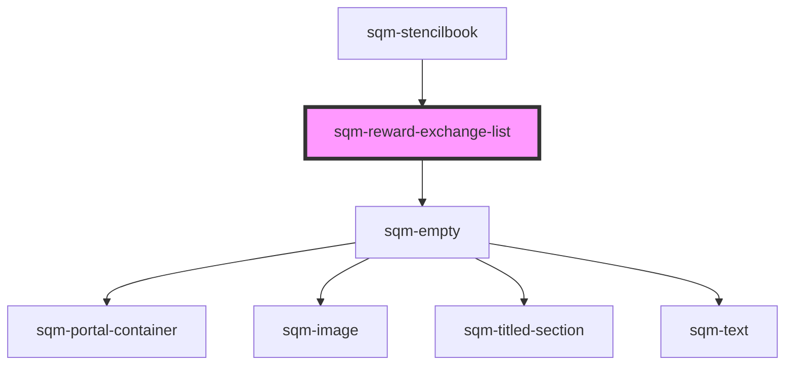

# sqm-reward-exchange-list

<!-- Auto Generated Below -->

## Properties

| Property                     | Attribute                       | Description                                                                      | Type                                                                                                                                                                                                                                                                                                                                          | Default                                                                                                                                                                                  |
| ---------------------------- | ------------------------------- | -------------------------------------------------------------------------------- | --------------------------------------------------------------------------------------------------------------------------------------------------------------------------------------------------------------------------------------------------------------------------------------------------------------------------------------------- | ---------------------------------------------------------------------------------------------------------------------------------------------------------------------------------------- |
| `backText`                   | `back-text`                     |                                                                                  | `string`                                                                                                                                                                                                                                                                                                                                      | `"Back"`                                                                                                                                                                                 |
| `cancelText`                 | `cancel-text`                   |                                                                                  | `string`                                                                                                                                                                                                                                                                                                                                      | `"Cancel"`                                                                                                                                                                               |
| `chooseAmountTitle`          | `choose-amount-title`           |                                                                                  | `string`                                                                                                                                                                                                                                                                                                                                      | `"Select"`                                                                                                                                                                               |
| `chooseRewardTitle`          | `choose-reward-title`           |                                                                                  | `string`                                                                                                                                                                                                                                                                                                                                      | `"Rewards"`                                                                                                                                                                              |
| `confirmationTitle`          | `confirmation-title`            |                                                                                  | `string`                                                                                                                                                                                                                                                                                                                                      | `"Confirm"`                                                                                                                                                                              |
| `continueText`               | `continue-text`                 |                                                                                  | `string`                                                                                                                                                                                                                                                                                                                                      | `"Continue"`                                                                                                                                                                             |
| `continueToConfirmationText` | `continue-to-confirmation-text` | Displayed on the reward selection page.                                          | `string`                                                                                                                                                                                                                                                                                                                                      | `"Continue to confirmation"`                                                                                                                                                             |
| `costTitle`                  | `cost-title`                    | Shown in the confirmation state.                                                 | `string`                                                                                                                                                                                                                                                                                                                                      | `"Cost to Redeem"`                                                                                                                                                                       |
| `demoData`                   | --                              |                                                                                  | `{ states?: { selectedItem: ExchangeItem; selectedStep: ExchangeStep; redeemStage: string; amount: number; exchangeError: boolean; queryError: boolean; loading: boolean; open: boolean; noExchangeOptions: boolean; content: { text: TextContent; }; }; data?: { exchangeList: any; fuelTankCode?: string; }; refs?: { canvasRef: any; }; }` | `undefined`                                                                                                                                                                              |
| `doneText`                   | `done-text`                     |                                                                                  | `string`                                                                                                                                                                                                                                                                                                                                      | `"Done"`                                                                                                                                                                                 |
| `notAvailableError`          | `not-available-error`           |                                                                                  | `string`                                                                                                                                                                                                                                                                                                                                      | `"{unavailableReasonCode, select, US_TAX {US Tax limit} INSUFFICIENT_REDEEMABLE_CREDIT {{sourceValue} required} AVAILABILITY_PREDICATE {Not available} other {unavailableReasonCode} }"` |
| `notEnoughError`             | `not-enough-error`              |                                                                                  | `string`                                                                                                                                                                                                                                                                                                                                      | `"Not enough {sourceUnit} to redeem for this reward"`                                                                                                                                    |
| `promoCode`                  | `promo-code`                    |                                                                                  | `string`                                                                                                                                                                                                                                                                                                                                      | `"Promo Code"`                                                                                                                                                                           |
| `queryError`                 | `query-error`                   | Shown if an error occurs when loading the reward exchange.                       | `string`                                                                                                                                                                                                                                                                                                                                      | `"Unable to load reward exchange list. Please try again"`                                                                                                                                |
| `redeemText`                 | `redeem-text`                   |                                                                                  | `string`                                                                                                                                                                                                                                                                                                                                      | `"Redeem"`                                                                                                                                                                               |
| `redeemTitle`                | `redeem-title`                  | Displayed as the header for the confirmation page.                               | `string`                                                                                                                                                                                                                                                                                                                                      | `"Confirm and redeem"`                                                                                                                                                                   |
| `redemptionError`            | `redemption-error`              | Shown if an error occurs during the reward exchange.                             | `string`                                                                                                                                                                                                                                                                                                                                      | `"An error occured trying to redeem this reward. Please try again"`                                                                                                                      |
| `redemptionSuccessText`      | `redemption-success-text`       | Displayed on the success screen when a user successfully exchanges for a reward. | `string`                                                                                                                                                                                                                                                                                                                                      | `"Redeemed {sourceValue} for {destinationValue}"`                                                                                                                                        |
| `rewardAmountTitle`          | `reward-amount-title`           | Shown in the confirmation state.                                                 | `string`                                                                                                                                                                                                                                                                                                                                      | `"Reward Amount"`                                                                                                                                                                        |
| `rewardNameTitle`            | `reward-name-title`             | Shown in the confirmation state.                                                 | `string`                                                                                                                                                                                                                                                                                                                                      | `"Reward"`                                                                                                                                                                               |
| `rewardRedeemedText`         | `reward-redeemed-text`          |                                                                                  | `string`                                                                                                                                                                                                                                                                                                                                      | `"Reward redeemed"`                                                                                                                                                                      |
| `rewardTitle`                | `reward-title`                  |                                                                                  | `string`                                                                                                                                                                                                                                                                                                                                      | `"Choose a reward"`                                                                                                                                                                      |
| `selectText`                 | `select-text`                   |                                                                                  | `string`                                                                                                                                                                                                                                                                                                                                      | `"Select amount to receive"`                                                                                                                                                             |
| `skeletonCardNum`            | `skeleton-card-num`             | Set the number of placeholder cards to be shown in loading state.                | `number`                                                                                                                                                                                                                                                                                                                                      | `8`                                                                                                                                                                                      |
| `sourceAmountMessage`        | `source-amount-message`         | Displayed on the reward exchange cards.                                          | `string`                                                                                                                                                                                                                                                                                                                                      | `"{ruleType, select, FIXED_GLOBAL_REWARD {{sourceValue}} other {{sourceMinValue} to {sourceMaxValue}}}"`                                                                                 |
| `tooltipText`                | `tooltip-text`                  | Shown when a user copies a fuel tank code                                        | `string`                                                                                                                                                                                                                                                                                                                                      | `"Copied"`                                                                                                                                                                               |

## Dependencies

### Used by

 - [sqm-stencilbook](../sqm-stencilbook)

### Depends on

- [sqm-empty](../sqm-empty)

### Graph

----------------------------------------------

*Built with [StencilJS](https://stenciljs.com/)*
