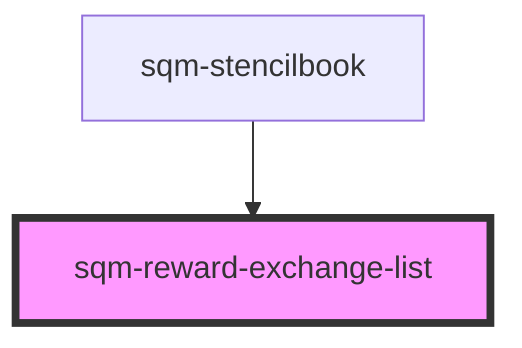

# sqm-reward-exchange-list

<!-- Auto Generated Below -->

## Properties

| Property   | Attribute   | Description | Type                                                                                                                                                                                                 | Default     |
| ---------- | ----------- | ----------- | ---------------------------------------------------------------------------------------------------------------------------------------------------------------------------------------------------- | ----------- |
| `demoData` | --          |             | `{ states?: { selectedItem: ExchangeItem; selectedStep: ExchangeStep; redeemStage: string; amount: number; exchangeError?: boolean; }; data?: { exchangeList: any; }; refs?: { drawerRef: any; }; }` | `undefined` |
| `listType` | `list-type` |             | `string`                                                                                                                                                                                             | `undefined` |

## Dependencies

### Used by

 - [sqm-stencilbook](../sqm-stencilbook)

### Graph

----------------------------------------------

*Built with [StencilJS](https://stenciljs.com/)*
