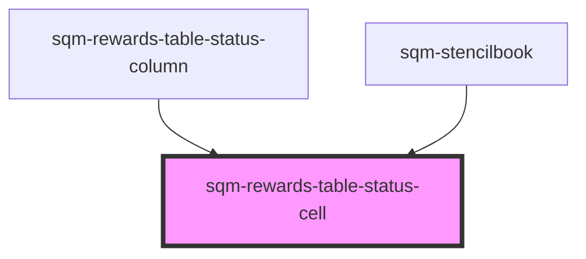

# sqm-rewards-table-cell

<!-- Auto Generated Below -->

## Properties

| Property           | Attribute           | Description | Type     | Default               |
| ------------------ | ------------------- | ----------- | -------- | --------------------- |
| `expiryText`       | `expiry-text`       |             | `string` | `"Expires"`           |
| `locale`           | `locale`            |             | `string` | `"en"`                |
| `pendingScheduled` | `pending-scheduled` |             | `string` | `"Until"`             |
| `pendingUnhandled` | `pending-unhandled` |             | `string` | `"Fulfillment error"` |
| `pendingUsTax`     | `pending-us-tax`    |             | `string` | `"W-9 required"`      |
| `reward`           | --                  |             | `Reward` | `undefined`           |
| `statusText`       | `status-text`       |             | `string` | `undefined`           |

## Dependencies

### Used by

 - [sqm-rewards-table-status-column](../columns)
 - [sqm-stencilbook](../../sqm-stencilbook)

### Graph

----------------------------------------------

*Built with [StencilJS](https://stenciljs.com/)*
