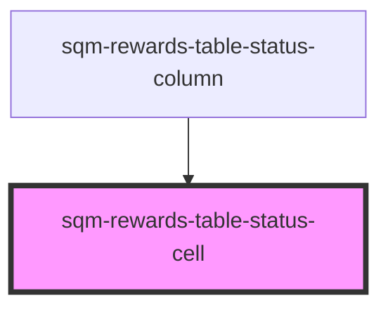

# sqm-referral-table-user-cell

<!-- Auto Generated Below -->

## Properties

| Property     | Attribute     | Description | Type     | Default     |
| ------------ | ------------- | ----------- | -------- | ----------- |
| `expiryText` | `expiry-text` |             | `string` | `undefined` |
| `reward`     | --            |             | `Reward` | `undefined` |
| `statusText` | `status-text` |             | `string` | `undefined` |

## Dependencies

### Used by

 - [sqm-rewards-table-status-column](../columns)

### Graph

----------------------------------------------

*Built with [StencilJS](https://stenciljs.com/)*
