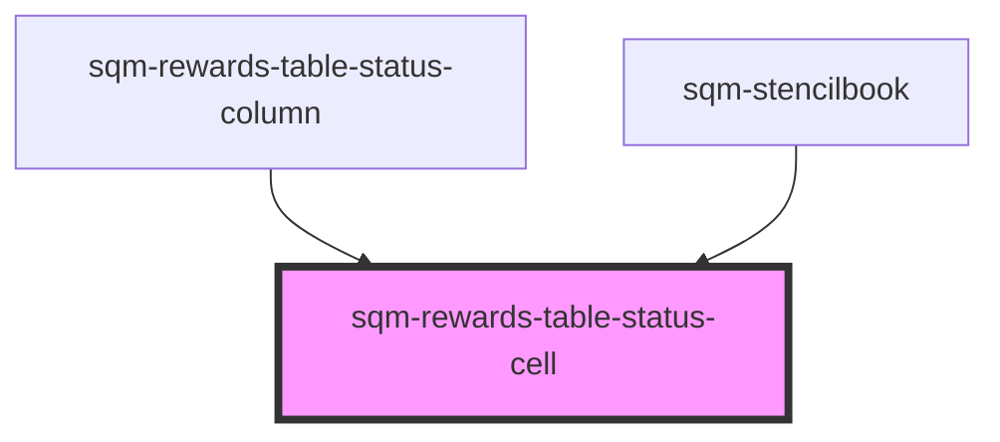

# sqm-rewards-table-cell

<!-- Auto Generated Below -->

## Properties

| Property                 | Attribute                  | Description | Type     | Default                                                                              |
| ------------------------ | -------------------------- | ----------- | -------- | ------------------------------------------------------------------------------------ |
| `deniedText`             | `denied-text`              |             | `string` | `"Detected self-referral"`                                                           |
| `expiryText`             | `expiry-text`              |             | `string` | `"Expires"`                                                                          |
| `locale`                 | `locale`                   |             | `string` | `"en"`                                                                               |
| `payoutApproved`         | `payout-approved`          |             | `string` | `"Reward approved for payout and was scheduled for payment based on your settings."` |
| `payoutCancelled`        | `payout-cancelled`         |             | `string` | `"If you think this is a mistake, contact our Support team."`                        |
| `payoutFailed`           | `payout-failed`            |             | `string` | `"Payout failed due to a fulfillment issue and is current being retried."`           |
| `pendingNewTaxForm`      | `pending-new-tax-form`     |             | `string` | `"Invalid tax form. Submit a new form to receive your rewards."`                     |
| `pendingPartnerCreation` | `pending-partner-creation` |             | `string` | `"Complete your tax and cash payout setup to receive your rewards."`                 |
| `pendingReviewText`      | `pending-review-text`      |             | `string` | `"Awaiting review"`                                                                  |
| `pendingScheduled`       | `pending-scheduled`        |             | `string` | `"Until"`                                                                            |
| `pendingTaxReview`       | `pending-tax-review`       |             | `string` | `"Awaiting tax form review."`                                                        |
| `pendingTaxSubmission`   | `pending-tax-submission`   |             | `string` | `"Submit your tax documents to receive your rewards."`                               |
| `pendingUnhandled`       | `pending-unhandled`        |             | `string` | `"Fulfillment error"`                                                                |
| `pendingUsTax`           | `pending-us-tax`           |             | `string` | `"W-9 required"`                                                                     |
| `reward`                 | `reward`                   |             | `any`    | `undefined`                                                                          |
| `statusText`             | `status-text`              |             | `string` | `undefined`                                                                          |
| `taxConnection`          | `tax-connection`           |             | `any`    | `undefined`                                                                          |

## Dependencies

### Used by

 - [sqm-rewards-table-status-column](../columns)
 - [sqm-stencilbook](../../sqm-stencilbook)

### Graph

----------------------------------------------

*Built with [StencilJS](https://stenciljs.com/)*
