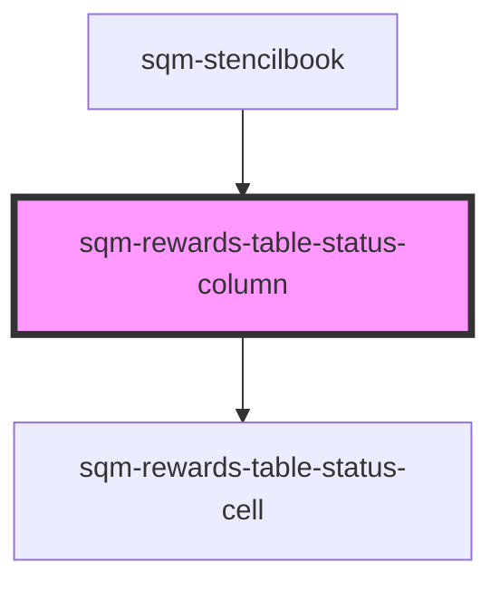

# sqm-referral-table-user-column

<!-- Auto Generated Below -->

## Properties

| Property      | Attribute      | Description | Type     | Default                                                                                                                                          |
| ------------- | -------------- | ----------- | -------- | ------------------------------------------------------------------------------------------------------------------------------------------------ |
| `columnTitle` | `column-title` |             | `string` | `"Status"`                                                                                                                                       |
| `expiryText`  | `expiry-text`  |             | `string` | `"Expires on "`                                                                                                                                  |
| `statusText`  | `status-text`  |             | `string` | `"{status, select, AVAILABLE {Available} CANCELLED {Cancelled} PENDING {Pending} EXPIRED {Expired} REDEEMED {Redeemed} other {Not available} }"` |

## Methods

### `renderCell(data: Reward[], locale: string) => Promise<any>`

#### Returns

Type: `Promise<any>`

### `renderLabel() => Promise<string>`

#### Returns

Type: `Promise<string>`

## Dependencies

### Used by

 - [sqm-stencilbook](../../sqm-stencilbook)

### Depends on

- [sqm-rewards-table-status-cell](../cells)

### Graph

----------------------------------------------

*Built with [StencilJS](https://stenciljs.com/)*
