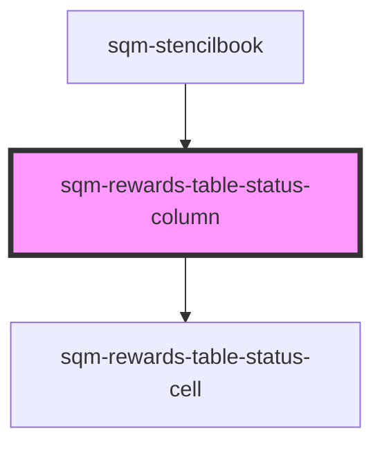

# sqm-rewards-table-column

<!-- Auto Generated Below -->

## Properties

| Property                 | Attribute                  | Description                                                                          | Type     | Default                                                                                                                                                                                                                                                                                                                                                                           |
| ------------------------ | -------------------------- | ------------------------------------------------------------------------------------ | -------- | --------------------------------------------------------------------------------------------------------------------------------------------------------------------------------------------------------------------------------------------------------------------------------------------------------------------------------------------------------------------------------- |
| `columnTitle`            | `column-title`             |                                                                                      | `string` | `"Status"`                                                                                                                                                                                                                                                                                                                                                                        |
| `deniedText`             | `denied-text`              | Displayed when denied for fraud.                                                     | `string` | `"Detected self-referral"`                                                                                                                                                                                                                                                                                                                                                        |
| `expiryText`             | `expiry-text`              | Text shown before the date of an expiring reward.                                    | `string` | `"Expires on "`                                                                                                                                                                                                                                                                                                                                                                   |
| `payoutFailed`           | `payout-failed`            | Displayed when reward payout has failed (based on Impact cash payout configuration). | `string` | `"This payout will be retried on {date}."`                                                                                                                                                                                                                                                                                                                                        |
| `payoutSent`             | `payout-sent`              | Displayed when reward payout is sent (based on Impact cash payout configuration).    | `string` | `"Payout process started on {date}. Expected payout on {date}."`                                                                                                                                                                                                                                                                                                                  |
| `pendingNewTaxForm`      | `pending-new-tax-form`     | Displayed when pending due to requiring a new tax document                           | `string` | `"Invalid tax form. Submit a new form to receive your rewards."`                                                                                                                                                                                                                                                                                                                  |
| `pendingPartnerCreation` | `pending-partner-creation` | Displayed when pending due to need to connect to an Impact partner                   | `string` | `"Complete your tax and cash payout setup to receive your rewards."`                                                                                                                                                                                                                                                                                                              |
| `pendingReviewText`      | `pending-review-text`      | Displayed when flagged for fraud.                                                    | `string` | `"Awaiting review"`                                                                                                                                                                                                                                                                                                                                                               |
| `pendingScheduled`       | `pending-scheduled`        | Text shown before the available date of a pending reward.                            | `string` | `"Until"`                                                                                                                                                                                                                                                                                                                                                                         |
| `pendingTaxReview`       | `pending-tax-review`       | Displayed when pending due to tax document review.                                   | `string` | `"Awaiting tax form review."`                                                                                                                                                                                                                                                                                                                                                     |
| `pendingTaxSubmission`   | `pending-tax-submission`   | Displayed when pending due to lack of tax document submission.                       | `string` | `"Submit your tax documents to receive your rewards."`                                                                                                                                                                                                                                                                                                                            |
| `pendingUnhandled`       | `pending-unhandled`        | Displayed when fulfillment error occured when creating a reward.                     | `string` | `"Fulfillment error"`                                                                                                                                                                                                                                                                                                                                                             |
| `pendingUsTax`           | `pending-us-tax`           | Displayed when a reward is pending due to W9 compliance.                             | `string` | `"W-9 required"`                                                                                                                                                                                                                                                                                                                                                                  |
| `statusText`             | `status-text`              |                                                                                      | `string` | `"{status, select, AVAILABLE {Available} CANCELLED {Cancelled} PENDING {Pending} PENDING_REVIEW {Pending} PAYOUT_SENT {Payout Sent} PAYOUT_FAILED {Payout Failed} PENDING_TAX_REVIEW {Pending} PENDING_NEW_TAX_FORM {Pending} PENDING_TAX_SUBMISSION {Pending} PENDING_PARTNER_CREATION {Pending} EXPIRED {Expired} REDEEMED {Redeemed} DENIED {Denied} other {Not available} }"` |

## Methods

### `renderCell(data: Reward, options: { locale: string; taxConnection: ImpactConnection; }) => Promise<any>`

#### Returns

Type: `Promise<any>`

### `renderLabel() => Promise<string>`

#### Returns

Type: `Promise<string>`

## Dependencies

### Used by

 - [sqm-stencilbook](../../sqm-stencilbook)

### Depends on

- [sqm-rewards-table-status-cell](../cells)

### Graph

----------------------------------------------

*Built with [StencilJS](https://stenciljs.com/)*
