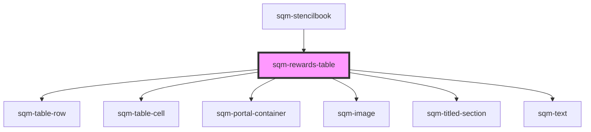

# sqm-rewards-table

<!-- Auto Generated Below -->

## Properties

| Property           | Attribute            | Description                                                                                                                                                                                                      | Type                                                                                                                                                                                                                                                                                                                                                                                                               | Default                                                                                         |
| ------------------ | -------------------- | ---------------------------------------------------------------------------------------------------------------------------------------------------------------------------------------------------------------- | ------------------------------------------------------------------------------------------------------------------------------------------------------------------------------------------------------------------------------------------------------------------------------------------------------------------------------------------------------------------------------------------------------------------ | ----------------------------------------------------------------------------------------------- |
| `demoData`         | --                   |                                                                                                                                                                                                                  | `{ states?: { hasPrev: boolean; hasNext: boolean; show: "loading" \| "empty" \| "rows"; namespace: string; }; data?: { textOverrides: { showLabels: boolean; prevLabel: string; moreLabel: string; }; hiddenColumns: string; mdBreakpoint: number; smBreakpoint: number; }; elements?: { columns: string[]; rows: VNode[][]; loading?: boolean; emptyElement?: VNode; loadingElement?: VNode; page?: number; }; }` | `undefined`                                                                                     |
| `emptyStateHeader` | `empty-state-header` |                                                                                                                                                                                                                  | `string`                                                                                                                                                                                                                                                                                                                                                                                                           | `"View your rewards"`                                                                           |
| `emptyStateImage`  | `empty-state-image`  |                                                                                                                                                                                                                  | `string`                                                                                                                                                                                                                                                                                                                                                                                                           | `"https://res.cloudinary.com/saasquatch/image/upload/v1642618031/squatch-assets/image_4_1.png"` |
| `emptyStateText`   | `empty-state-text`   |                                                                                                                                                                                                                  | `string`                                                                                                                                                                                                                                                                                                                                                                                                           | `"See all the rewards you have earned from referring friends and completing tasks"`             |
| `hiddenColumns`    | `hidden-columns`     |                                                                                                                                                                                                                  | `string`                                                                                                                                                                                                                                                                                                                                                                                                           | `"0"`                                                                                           |
| `mdBreakpoint`     | `md-breakpoint`      |                                                                                                                                                                                                                  | `number`                                                                                                                                                                                                                                                                                                                                                                                                           | `899`                                                                                           |
| `moreLabel`        | `more-label`         |                                                                                                                                                                                                                  | `string`                                                                                                                                                                                                                                                                                                                                                                                                           | `"Next"`                                                                                        |
| `perPage`          | `per-page`           |                                                                                                                                                                                                                  | `number`                                                                                                                                                                                                                                                                                                                                                                                                           | `3`                                                                                             |
| `prevLabel`        | `prev-label`         |                                                                                                                                                                                                                  | `string`                                                                                                                                                                                                                                                                                                                                                                                                           | `"Prev"`                                                                                        |
| `programId`        | `program-id`         | Filters to only show rewards in this program. Will default to filtering by the program context where this table lives. If no program ID is set or provided by context, then shows all rewards from all programs. | `string`                                                                                                                                                                                                                                                                                                                                                                                                           | `undefined`                                                                                     |
| `showLabels`       | `show-labels`        |                                                                                                                                                                                                                  | `boolean`                                                                                                                                                                                                                                                                                                                                                                                                          | `true`                                                                                          |
| `smBreakpoint`     | `sm-breakpoint`      |                                                                                                                                                                                                                  | `number`                                                                                                                                                                                                                                                                                                                                                                                                           | `599`                                                                                           |

## Dependencies

### Used by

 - [sqm-stencilbook](../sqm-stencilbook)

### Depends on

- [sqm-table-row](../sqm-table-row)
- [sqm-table-cell](../sqm-table-cell)
- [sqm-portal-container](../sqm-portal-container)
- [sqm-image](../sqm-image)
- [sqm-titled-section](../sqm-titled-section)
- [sqm-text](../sqm-text)

### Graph

----------------------------------------------

*Built with [StencilJS](https://stenciljs.com/)*
