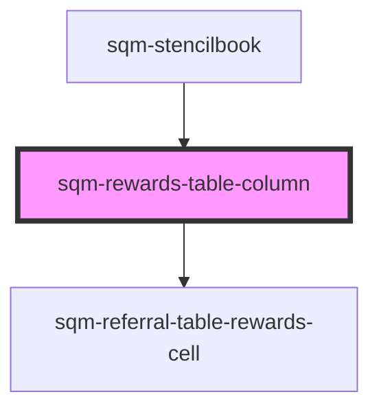

# sqm-rewards-table

<!-- Auto Generated Below -->

## Properties

| Property      | Attribute      | Description | Type      | Default     |
| ------------- | -------------- | ----------- | --------- | ----------- |
| `columnTitle` | `column-title` |             | `string`  | `"Rewards"` |
| `hideDetails` | `hide-details` |             | `boolean` | `false`     |

## Methods

### `renderCell(data: Reward[]) => Promise<any>`

#### Returns

Type: `Promise<any>`

### `renderLabel() => Promise<string>`

#### Returns

Type: `Promise<string>`

## Dependencies

### Used by

 - [sqm-stencilbook](../sqm-stencilbook)

### Depends on

- [sqm-referral-table-rewards-cell](../sqm-referral-table/cells)

### Graph

----------------------------------------------

*Built with [StencilJS](https://stenciljs.com/)*
