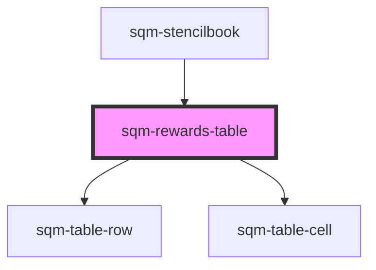

# sqm-rewards-table

<!-- Auto Generated Below -->

## Properties

| Property        | Attribute        | Description                                                                                                                                                                                                      | Type                                                                                                                                                                                                                                                                                                                                                                                                               | Default     |
| --------------- | ---------------- | ---------------------------------------------------------------------------------------------------------------------------------------------------------------------------------------------------------------- | ------------------------------------------------------------------------------------------------------------------------------------------------------------------------------------------------------------------------------------------------------------------------------------------------------------------------------------------------------------------------------------------------------------------ | ----------- |
| `demoData`      | --               |                                                                                                                                                                                                                  | `{ states?: { hasPrev: boolean; hasNext: boolean; show: "loading" \| "empty" \| "rows"; namespace: string; }; data?: { textOverrides: { showLabels: boolean; prevLabel: string; moreLabel: string; }; hiddenColumns: string; mdBreakpoint: number; smBreakpoint: number; }; elements?: { columns: string[]; rows: VNode[][]; loading?: boolean; emptyElement?: VNode; loadingElement?: VNode; page?: number; }; }` | `undefined` |
| `hiddenColumns` | `hidden-columns` |                                                                                                                                                                                                                  | `string`                                                                                                                                                                                                                                                                                                                                                                                                           | `"0"`       |
| `mdBreakpoint`  | `md-breakpoint`  |                                                                                                                                                                                                                  | `number`                                                                                                                                                                                                                                                                                                                                                                                                           | `899`       |
| `moreLabel`     | `more-label`     |                                                                                                                                                                                                                  | `string`                                                                                                                                                                                                                                                                                                                                                                                                           | `"Next"`    |
| `perPage`       | `per-page`       |                                                                                                                                                                                                                  | `number`                                                                                                                                                                                                                                                                                                                                                                                                           | `4`         |
| `prevLabel`     | `prev-label`     |                                                                                                                                                                                                                  | `string`                                                                                                                                                                                                                                                                                                                                                                                                           | `"Prev"`    |
| `programId`     | `program-id`     | Filters to only show rewards in this program. Will default to filtering by the program context where this table lives. If no program ID is set or provided by context, then shows all rewards from all programs. | `string`                                                                                                                                                                                                                                                                                                                                                                                                           | `undefined` |
| `showLabels`    | `show-labels`    |                                                                                                                                                                                                                  | `boolean`                                                                                                                                                                                                                                                                                                                                                                                                          | `true`      |
| `smBreakpoint`  | `sm-breakpoint`  |                                                                                                                                                                                                                  | `number`                                                                                                                                                                                                                                                                                                                                                                                                           | `599`       |

## Dependencies

### Used by

 - [sqm-stencilbook](../sqm-stencilbook)

### Depends on

- [sqm-table-row](../sqm-table-row)
- [sqm-table-cell](../sqm-table-cell)

### Graph

----------------------------------------------

*Built with [StencilJS](https://stenciljs.com/)*
