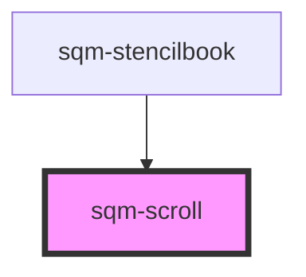

# sqm-scroll

<!-- Auto Generated Below -->

## Properties

| Property          | Attribute          | Description | Type                                                                                  | Default     |
| ----------------- | ------------------ | ----------- | ------------------------------------------------------------------------------------- | ----------- |
| `buttonText`      | `button-text`      |             | `string`                                                                              | `undefined` |
| `buttonType`      | `button-type`      |             | `"danger" \| "default" \| "neutral" \| "primary" \| "success" \| "text" \| "warning"` | `"default"` |
| `caret`           | `caret`            |             | `boolean`                                                                             | `undefined` |
| `circle`          | `circle`           |             | `boolean`                                                                             | `undefined` |
| `disabled`        | `disabled`         |             | `boolean`                                                                             | `undefined` |
| `download`        | `download`         |             | `string`                                                                              | `undefined` |
| `href`            | `href`             |             | `string`                                                                              | `undefined` |
| `iconName`        | `icon-name`        |             | `string`                                                                              | `undefined` |
| `iconSlot`        | `icon-slot`        |             | `string`                                                                              | `undefined` |
| `loading`         | `loading`          |             | `boolean`                                                                             | `undefined` |
| `name`            | `name`             |             | `string`                                                                              | `undefined` |
| `outline`         | `outline`          |             | `boolean`                                                                             | `undefined` |
| `pill`            | `pill`             |             | `boolean`                                                                             | `undefined` |
| `scrollAnimation` | `scroll-animation` |             | `"auto" \| "smooth"`                                                                  | `"smooth"`  |
| `scrollId`        | `scroll-id`        |             | `string`                                                                              | `undefined` |
| `scrollTagName`   | `scroll-tag-name`  |             | `string`                                                                              | `undefined` |
| `size`            | `size`             |             | `string`                                                                              | `undefined` |
| `target`          | `target`           |             | `string`                                                                              | `undefined` |

## Dependencies

### Used by

 - [sqm-stencilbook](../sqm-stencilbook)

### Graph

----------------------------------------------

*Built with [StencilJS](https://stenciljs.com/)*
