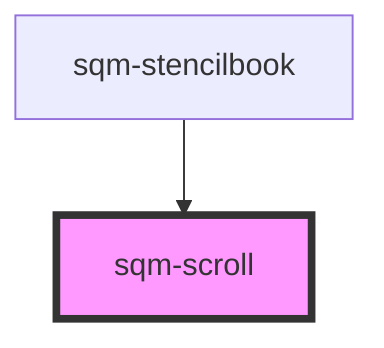

# sqm-scroll

<!-- Auto Generated Below -->

## Properties

| Property          | Attribute          | Description | Type                 | Default     |
| ----------------- | ------------------ | ----------- | -------------------- | ----------- |
| `buttonText`      | `button-text`      |             | `string`             | `undefined` |
| `buttonType`      | `button-type`      |             | `string`             | `"primary"` |
| `scrollAnimation` | `scroll-animation` |             | `"auto" \| "smooth"` | `"smooth"`  |
| `scrollId`        | `scroll-id`        |             | `string`             | `undefined` |
| `scrollTagName`   | `scroll-tag-name`  |             | `string`             | `undefined` |

## Dependencies

### Used by

 - [sqm-stencilbook](../sqm-stencilbook)

### Graph

----------------------------------------------

*Built with [StencilJS](https://stenciljs.com/)*
