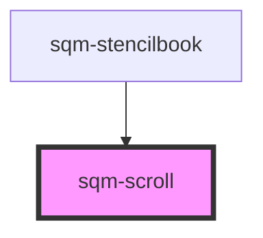

# sqm-scroll

<!-- Auto Generated Below -->

## Properties

| Property          | Attribute          | Description                                                            | Type                                                                                  | Default     |
| ----------------- | ------------------ | ---------------------------------------------------------------------- | ------------------------------------------------------------------------------------- | ----------- |
| `buttonText`      | `button-text`      |                                                                        | `string`                                                                              | `undefined` |
| `buttonType`      | `button-type`      |                                                                        | `"danger" \| "default" \| "neutral" \| "primary" \| "success" \| "text" \| "warning"` | `"default"` |
| `circle`          | `circle`           | Draws a circle button.                                                 | `boolean`                                                                             | `undefined` |
| `iconName`        | `icon-name`        |                                                                        | `string`                                                                              | `undefined` |
| `iconSlot`        | `icon-slot`        |                                                                        | `string`                                                                              | `undefined` |
| `mobile`          | `mobile`           | The button becomes full width if the screen size is smaller than 500px | `boolean`                                                                             | `undefined` |
| `outline`         | `outline`          | Draws an outlined button.                                              | `boolean`                                                                             | `undefined` |
| `pill`            | `pill`             | Draws a pill-style button with rounded edges.                          | `boolean`                                                                             | `undefined` |
| `scrollAnimation` | `scroll-animation` |                                                                        | `"auto" \| "smooth"`                                                                  | `"smooth"`  |
| `scrollId`        | `scroll-id`        |                                                                        | `string`                                                                              | `undefined` |
| `scrollTagName`   | `scroll-tag-name`  |                                                                        | `string`                                                                              | `undefined` |
| `size`            | `size`             |                                                                        | `string`                                                                              | `undefined` |

## Dependencies

### Used by

 - [sqm-stencilbook](../sqm-stencilbook)

### Graph

----------------------------------------------

*Built with [StencilJS](https://stenciljs.com/)*
