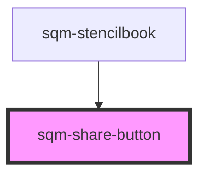

# sqm-share-button

<!-- Auto Generated Below -->

## Properties

| Property          | Attribute          | Description                                                                                                               | Type                                                                                                                                                                                                                                                                                                                                                                                                                                                                                                                                                                        | Default     |
| ----------------- | ------------------ | ------------------------------------------------------------------------------------------------------------------------- | --------------------------------------------------------------------------------------------------------------------------------------------------------------------------------------------------------------------------------------------------------------------------------------------------------------------------------------------------------------------------------------------------------------------------------------------------------------------------------------------------------------------------------------------------------------------------- | ----------- |
| `backgroundColor` | `background-color` |                                                                                                                           | `string`                                                                                                                                                                                                                                                                                                                                                                                                                                                                                                                                                                    | `undefined` |
| `borderRadius`    | `border-radius`    |                                                                                                                           | `number`                                                                                                                                                                                                                                                                                                                                                                                                                                                                                                                                                                    | `undefined` |
| `demoData`        | --                 |                                                                                                                           | `{ loading?: boolean; medium?: "facebook" \| "twitter" \| "email" \| "direct" \| "linkedin" \| "sms" \| "fbmessenger" \| "whatsapp" \| "linemessenger" \| "pinterest" \| "reminder" \| "unknown"; disabled?: boolean; pill?: boolean; type?: "text" \| "default" \| "primary" \| "success" \| "warning" \| "danger" \| "info"; size?: "small" \| "medium" \| "large"; icon?: string; hideIcon?: boolean; hideText?: boolean; iconSlot?: "prefix" \| "suffix"; onClick?: () => void; hide?: boolean; borderRadius?: number; backgroundColor?: string; textColor?: string; }` | `undefined` |
| `disabled`        | `disabled`         |                                                                                                                           | `boolean`                                                                                                                                                                                                                                                                                                                                                                                                                                                                                                                                                                   | `undefined` |
| `hideIcon`        | `hide-icon`        |                                                                                                                           | `boolean`                                                                                                                                                                                                                                                                                                                                                                                                                                                                                                                                                                   | `false`     |
| `hideText`        | `hide-text`        |                                                                                                                           | `boolean`                                                                                                                                                                                                                                                                                                                                                                                                                                                                                                                                                                   | `false`     |
| `icon`            | `icon`             | Options available at https://shoelace.style/components/icon                                                               | `string`                                                                                                                                                                                                                                                                                                                                                                                                                                                                                                                                                                    | `undefined` |
| `iconSlot`        | `icon-slot`        |                                                                                                                           | `"prefix" \| "suffix"`                                                                                                                                                                                                                                                                                                                                                                                                                                                                                                                                                      | `"prefix"`  |
| `medium`          | `medium`           | The social medium to share on. Share messages and links will be pulled from your program config and tagged for analytics. | `"direct" \| "email" \| "facebook" \| "fbmessenger" \| "linemessenger" \| "linkedin" \| "pinterest" \| "reminder" \| "sms" \| "twitter" \| "unknown" \| "whatsapp"`                                                                                                                                                                                                                                                                                                                                                                                                         | `undefined` |
| `pill`            | `pill`             |                                                                                                                           | `boolean`                                                                                                                                                                                                                                                                                                                                                                                                                                                                                                                                                                   | `undefined` |
| `programId`       | `program-id`       | Optional programId, or uses the programId context where this button is rendered.                                          | `string`                                                                                                                                                                                                                                                                                                                                                                                                                                                                                                                                                                    | `undefined` |
| `shareText`       | `share-text`       |                                                                                                                           | `string`                                                                                                                                                                                                                                                                                                                                                                                                                                                                                                                                                                    | `undefined` |
| `shareTitle`      | `share-title`      |                                                                                                                           | `string`                                                                                                                                                                                                                                                                                                                                                                                                                                                                                                                                                                    | `undefined` |
| `size`            | `size`             |                                                                                                                           | `"large" \| "medium" \| "small"`                                                                                                                                                                                                                                                                                                                                                                                                                                                                                                                                            | `undefined` |
| `textColor`       | `text-color`       |                                                                                                                           | `string`                                                                                                                                                                                                                                                                                                                                                                                                                                                                                                                                                                    | `undefined` |
| `type`            | `type`             |                                                                                                                           | `"danger" \| "default" \| "info" \| "primary" \| "success" \| "text" \| "warning"`                                                                                                                                                                                                                                                                                                                                                                                                                                                                                          | `"default"` |

## Dependencies

### Used by

 - [sqm-stencilbook](../sqm-stencilbook)

### Graph

----------------------------------------------

*Built with [StencilJS](https://stenciljs.com/)*
