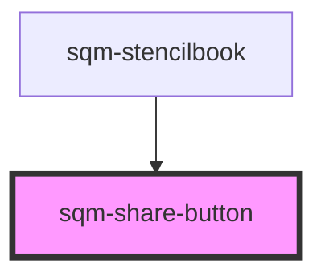

# sqm-share-button

<!-- Auto Generated Below -->

## Properties

| Property          | Attribute         | Description                                                                                                                                           | Type                                                                                                                                                                                                                                                                                                                                                                                                                                                                                                                                                                        | Default     |
| ----------------- | ----------------- | ----------------------------------------------------------------------------------------------------------------------------------------------------- | --------------------------------------------------------------------------------------------------------------------------------------------------------------------------------------------------------------------------------------------------------------------------------------------------------------------------------------------------------------------------------------------------------------------------------------------------------------------------------------------------------------------------------------------------------------------------- | ----------- |
| `backgroundcolor` | `backgroundcolor` |                                                                                                                                                       | `string`                                                                                                                                                                                                                                                                                                                                                                                                                                                                                                                                                                    | `undefined` |
| `borderradius`    | `borderradius`    | Configure border radius with pixel amount                                                                                                             | `number`                                                                                                                                                                                                                                                                                                                                                                                                                                                                                                                                                                    | `undefined` |
| `demoData`        | --                |                                                                                                                                                       | `{ loading?: boolean; medium?: "facebook" \| "twitter" \| "email" \| "direct" \| "linkedin" \| "sms" \| "fbmessenger" \| "whatsapp" \| "linemessenger" \| "pinterest" \| "reminder" \| "unknown"; disabled?: boolean; pill?: boolean; type?: "text" \| "default" \| "primary" \| "success" \| "warning" \| "danger" \| "info"; size?: "small" \| "medium" \| "large"; icon?: string; hideicon?: boolean; hidetext?: boolean; iconslot?: "prefix" \| "suffix"; onClick?: () => void; hide?: boolean; borderradius?: number; backgroundcolor?: string; textcolor?: string; }` | `undefined` |
| `disabled`        | `disabled`        |                                                                                                                                                       | `boolean`                                                                                                                                                                                                                                                                                                                                                                                                                                                                                                                                                                   | `undefined` |
| `hideicon`        | `hideicon`        |                                                                                                                                                       | `boolean`                                                                                                                                                                                                                                                                                                                                                                                                                                                                                                                                                                   | `false`     |
| `hidetext`        | `hidetext`        |                                                                                                                                                       | `boolean`                                                                                                                                                                                                                                                                                                                                                                                                                                                                                                                                                                   | `false`     |
| `icon`            | `icon`            | Options available at https://shoelace.style/components/icon  Icon used in button. Will try to select an icon based on the share medium if left empty. | `string`                                                                                                                                                                                                                                                                                                                                                                                                                                                                                                                                                                    | `undefined` |
| `iconslot`        | `iconslot`        |                                                                                                                                                       | `"prefix" \| "suffix"`                                                                                                                                                                                                                                                                                                                                                                                                                                                                                                                                                      | `"prefix"`  |
| `medium`          | `medium`          | The social medium to share on. Share messages and links will be pulled from your program config and tagged for analytics.                             | `"direct" \| "email" \| "facebook" \| "fbmessenger" \| "linemessenger" \| "linkedin" \| "pinterest" \| "reminder" \| "sms" \| "twitter" \| "unknown" \| "whatsapp"`                                                                                                                                                                                                                                                                                                                                                                                                         | `undefined` |
| `pill`            | `pill`            |                                                                                                                                                       | `boolean`                                                                                                                                                                                                                                                                                                                                                                                                                                                                                                                                                                   | `undefined` |
| `programId`       | `program-id`      | Optional programId, or uses the programId context where this button is rendered.                                                                      | `string`                                                                                                                                                                                                                                                                                                                                                                                                                                                                                                                                                                    | `undefined` |
| `sharetext`       | `sharetext`       | Text used for native sharing (mobile only)                                                                                                            | `string`                                                                                                                                                                                                                                                                                                                                                                                                                                                                                                                                                                    | `undefined` |
| `sharetitle`      | `sharetitle`      | Title used for native sharing (mobile only)                                                                                                           | `string`                                                                                                                                                                                                                                                                                                                                                                                                                                                                                                                                                                    | `undefined` |
| `size`            | `size`            |                                                                                                                                                       | `"large" \| "medium" \| "small"`                                                                                                                                                                                                                                                                                                                                                                                                                                                                                                                                            | `undefined` |
| `textcolor`       | `textcolor`       |                                                                                                                                                       | `string`                                                                                                                                                                                                                                                                                                                                                                                                                                                                                                                                                                    | `undefined` |
| `type`            | `type`            |                                                                                                                                                       | `"danger" \| "default" \| "info" \| "primary" \| "success" \| "text" \| "warning"`                                                                                                                                                                                                                                                                                                                                                                                                                                                                                          | `"default"` |

## Slots

| Slot                                        | Description |
| ------------------------------------------- | ----------- |
| `"[{"name":"", "title":"Button Content"}]"` |             |

## Dependencies

### Used by

 - [sqm-stencilbook](../sqm-stencilbook)

### Graph

----------------------------------------------

*Built with [StencilJS](https://stenciljs.com/)*
