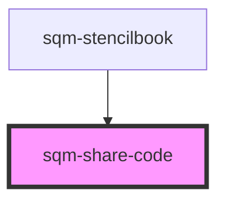

# sqm-share-code

<!-- Auto Generated Below -->

## Properties

| Property          | Attribute           | Description                                                                                                             | Type                                                                                                                                                                                                                                                                                                                                                                               | Default                 |
| ----------------- | ------------------- | ----------------------------------------------------------------------------------------------------------------------- | ---------------------------------------------------------------------------------------------------------------------------------------------------------------------------------------------------------------------------------------------------------------------------------------------------------------------------------------------------------------------------------- | ----------------------- |
| `buttonStyle`     | `copy-button-style` | Set the copy button style                                                                                               | `"button below" \| "button inside" \| "button outside" \| "icon"`                                                                                                                                                                                                                                                                                                                  | `"icon"`                |
| `copyButtonLabel` | `copy-button-label` | Set copy button label                                                                                                   | `string`                                                                                                                                                                                                                                                                                                                                                                           | `"Copy Code"`           |
| `demoData`        | --                  |                                                                                                                         | `{ loading?: boolean; copyString?: string; tooltiptext?: string; open?: boolean; copyButtonLabel?: string; disabled?: boolean; textAlign?: "left" \| "center"; buttonStyle?: "icon" \| "button inside" \| "button outside" \| "button below"; rewardStatus?: RewardStatusType; errorText?: string; inputPlaceholderText?: string; dateAvailable?: string; onClick?: () => void; }` | `undefined`             |
| `programId`       | `program-id`        | The ID of the program that should generate the code. Defaults to the program ID in context where this widget is loaded. | `string`                                                                                                                                                                                                                                                                                                                                                                           | `undefined`             |
| `textAlign`       | `text-align`        | Change the text alignment                                                                                               | `"center" \| "left"`                                                                                                                                                                                                                                                                                                                                                               | `"left"`                |
| `tooltiplifespan` | `tooltip-lifespan`  | The number of milliseconds that the tooltip appears for                                                                 | `number`                                                                                                                                                                                                                                                                                                                                                                           | `1000`                  |
| `tooltiptext`     | `tooltip-text`      | Shown inside a tooltip after someone has successfully copied the link to their clipboard.                               | `string`                                                                                                                                                                                                                                                                                                                                                                           | `"Copied to Clipboard"` |

## Dependencies

### Used by

 - [sqm-stencilbook](../sqm-stencilbook)

### Graph

----------------------------------------------

*Built with [StencilJS](https://stenciljs.com/)*
