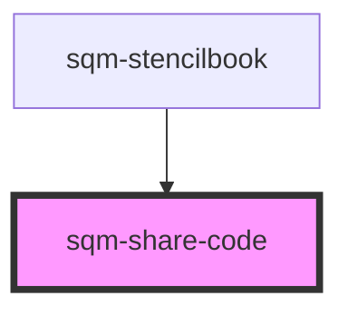

# sqm-share-code

<!-- Auto Generated Below -->

## Properties

| Property          | Attribute          | Description                                                                                                             | Type                                                                                                        | Default                    |
| ----------------- | ------------------ | ----------------------------------------------------------------------------------------------------------------------- | ----------------------------------------------------------------------------------------------------------- | -------------------------- |
| `demoData`        | --                 |                                                                                                                         | `{ disabled?: boolean; onClick?: () => void; shareString?: string; open?: boolean; tooltipText?: string; }` | `undefined`                |
| `programId`       | `program-id`       | The ID of the program that should generate the code. Defaults to the program ID in context where this widget is loaded. | `string`                                                                                                    | `undefined`                |
| `tooltipLifespan` | `tooltip-lifespan` | The number of milliseconds that the tooltip will appear for                                                             | `number`                                                                                                    | `DEFAULT_TOOLTIP_LIFESPAN` |
| `tooltipText`     | `tooltip-text`     | This is shown after someone has successfully copied the cpde to the clipboard.                                          | `string`                                                                                                    | `"Copied to Clipboard"`    |

## Dependencies

### Used by

 - [sqm-stencilbook](../sqm-stencilbook)

### Graph

----------------------------------------------

*Built with [StencilJS](https://stenciljs.com/)*
